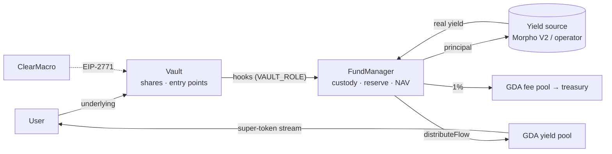

# Architecture

The system in one read. Family-specific detail lives in [`sync-vault/`](./sync-vault/) and
[`async-vault/`](./async-vault/); terms are defined in the [glossary](./glossary.md).

## 1. Shape

There are **two vault families** sharing one Superfluid GDA streaming engine:

- **Sync** — `StableYieldSyncVault` (ERC-4626) + `SyncFundManager`. Principal goes into an
  external ERC-4626 (a Morpho Vault V2); deposits and withdrawals are instant; the share floats.
- **Async** — `StableYieldAsyncVault` (ERC-7540 / ERC-7575) + `AsyncFundManager`. Deposits and
  redeems are requests settled per epoch by an operator who manages capital off-chain; the
  share price is locked per epoch.

```
src/common/FundManagerBase.sol               shared GDA engine (abstract)
src/vault/sync/StableYieldSyncVault.sol      ERC-4626 share/accounting face (ERC2771Context)
src/vault/sync/SyncFundManager.sol           custody + deposit/withdraw hooks + self-sourcing rebalance
src/vault/sync/SyncVaultMacro.sol            ClearMacro: permit + deposit + pool connect / redeem
src/vault/async/StableYieldAsyncVault.sol    ERC-7540 vault (ERC2771Context, Permit2 requests)
src/vault/async/AsyncFundManager.sol         epoch hooks + give/take capital movement
src/vault/async/AsyncVaultMacro.sol          ClearMacro: request / claim + pool connect
src/interfaces/common/ · vault/{sync,async}/ split symmetrically; IMorphoVaultV2 vendored
```



**Vault ↔ FundManager pinning.** The vault's constructor deploys its FundManager with
`msg.sender == vault`; the FM grants `VAULT_ROLE` to that address, pins `VAULT` as immutable,
and gives the vault unlimited approval on the underlying. No factory, no proxy, no migration —
read the vault first; the FM is meaningless in isolation.

## 2. The streaming engine (`FundManagerBase`, both families)

- The underlying (USDC, **exactly 6 decimals** — both vault constructors enforce it) is upgraded
  into its Superfluid super-token (`YIELD_ASSET`, USDCx) and held as the **yield reserve**.
- Two GDA pools, both owned by the FM and non-transferable: `YIELD_POOL` (holders) and
  `FEE_POOL` (the treasury holds its single unit).
- **Units** are granted on nominal principal: `_toUnit(assets) = assets / RAW_PER_UNIT`
  (`RAW_PER_UNIT = 10 ** (decimals − 6) = 1`), so one underlying atom = one unit and the streamed
  yield tracks what each holder put in, independent of the share price.
- `_flowRatePerUnit = SCALING_FACTOR · stableYieldRate / (YEAR · BP_DENOMINATOR)` with
  `SCALING_FACTOR = 10 ** (18 − decimals) = 1e12`. Yield flow = `_flowRatePerUnit · totalUnits`;
  fee flow = `FEE_BPS / 10_000` (1 %) of it, streamed to the fee pool **in parallel** (on top, not
  deducted). `_recalibrateFlow()` sets both.
- **Forward solvency.** The reserve must satisfy
  `yieldAssetsBalance() ≥ (yieldFlow + feeFlow) · guaranteedFlowDuration`
  (`MIN_GUARANTEED_FLOW_DURATION = 1 days`). `evaluateYieldAssetsDeficit()` measures the gap;
  `_rebalanceYieldAssets()` (abstract — each family sources it differently) closes it. The
  constructor and both setters enforce `rate × duration ≤ YEAR × 10_000`
  (`INVALID_YIELD_DURATION_COMBINATION`) so the pre-fund can never exceed a deposit.
- **Shares carry the stream.** Both vaults' `_update` hook calls `onShareTransfer(from, to,
  value)` on holder-to-holder transfers (mint/burn and vault-custody legs skipped); the FM moves a
  proportional slice of units. A zero-unit sender (dust position) is skipped, not reverted.
- **Roles** (OpenZeppelin `AccessControl` on the FM): `FUND_OPERATOR_ROLE` —
  `setStableYieldRate`, `ensureYieldFlowDuration` (+ async epoch ops and `give`/`take`);
  `DEFAULT_ADMIN_ROLE` — `setGuaranteedFlowDuration`, `emergencyWithdraw(token, amount)` (any
  token → `TREASURY`), role management, and the sync vault's `terminate()`; `VAULT_ROLE` — the
  paired vault, for the hooks.
- **Meta-transactions.** Both vaults are `ERC2771Context`, trusting the Superfluid Host's
  `ERC2771Forwarder` (resolved from the yield asset's Host at construction). Every user entry
  point resolves `_msgSender()`. This is what lets the ClearMacros act as the user.

## 3. Sync family

Authoritative: [`sync-vault/design.md`](./sync-vault/design.md),
[`invariants.md`](./sync-vault/invariants.md), [`flow/`](./sync-vault/flow/).

- **External = Morpho Vault V2**, a non-conventional ERC-4626: its four `max*` views are
  hardcoded to 0 and it has no instant-liquidity view. The integration never consults `max*`:
  position value = `EXTERNAL_VAULT.previewRedeem(balanceOf(FM))` (`externalPositionValue()`),
  eligibility = the gate views (`canDepositExternal()` = `canSendAssets(FM) && canReceiveShares(FM)`,
  `canWithdrawExternal()` = `canSendShares(FM) && canReceiveAssets(FM)`). NAV is a live spot
  read, so the external **must** be accrual-priced and non-manipulable (Morpho V2 is).
- **FM is sole custodian and NAV authority.** The vault holds nothing.
  `totalAssets = externalPositionValue() + scaledYieldAssetsBalance() + UNDERLYING.balanceOf(FM)`
  — a plain sum, no clamp. The share **floats**: total return = streamed promised rate +
  appreciation for `external − promised`; losses pass through immediately.
- **Deposit** (`onDeposit`): the vault takes the flat `DEPOSIT_FEE` (0.2 USDC → `TREASURY`),
  forwards the net; the FM grants units, runs `_rebalanceYieldAssets()` (deficit-only pull from
  Morpho, skipped below `MIN_EXTERNAL_PULL = 10` atoms because the Base USDCx wrapper's Aave leg
  reverts dust), upgrades the residual deficit from the incoming underlying into the reserve
  (pre-funded stream — the stream starts now, NAV-neutral), deposits the remainder into Morpho,
  recalibrates.
- **Withdraw** (`onWithdraw`): proportional unit decrease; payout = OZ pro-rata
  `shares · NAV / supply`, sourced from any resting raw underlying, then a shares-proportional
  slice of the reserve, then Morpho (`withdraw(x, FM, FM)` then one transfer to the receiver);
  post-payout rebalance; recalibrate (flow only ever decreases here, so it cannot revert on a
  drained reserve).
- **Rebalance** (`_rebalanceYieldAssets` override): `deficit > 0` → pull
  `min(deficit/1e12 + 1, externalPositionValue())` from Morpho and upgrade; can revert on an
  external liquidity shortfall and brick the calling op until liquidity returns (accepted;
  `forceDeallocate`). `deficit < 0` → best-effort trim: downgrade exactly `underlyingNeeded` and
  redeposit, only if the deposit gates clear. Runs from both hooks and the operator setters.
- **Pauses.** Deposits close when `terminated` (admin, one-way) or when Morpho's deposit gates
  block the FM. The **external pause** —
  `totalSupply() > 0 && (externalPositionValue() == 0 || !canWithdrawExternal())` — forces all
  four `max*` to 0 (total loss or blocked exit gates); the stream keeps paying from the reserve.
  A pure liquidity freeze does *not* pause: the affected withdrawal reverts at the Morpho leg.
- **Invariants to remember:** principal never rests in the FM as raw underlying across calls
  (custody hazard, A.2); `units/share` is deliberately not constant under a floating share
  (C.1); first-deposit inflation is mitigated by `_decimalsOffset() = 12`.

## 4. Async family

Authoritative: [`async-vault/flow/`](./async-vault/flow/) and
[`invariants.md`](./async-vault/invariants.md).

1. **Request** — `requestDeposit` (or `requestDepositWithPermit2`, a Permit2
   `permitWitnessTransferFrom` whose witness `depositWitness(controller)` pins the controller)
   escrows assets in the vault; `requestRedeem` pulls shares and the FM **decreases the
   redeemer's units immediately**. Both revert `EPOCH_SETTLEMENT_IN_PROGRESS` while a snapshot is
   open. Request id is always 0.
2. **`closeEpoch(workingAssets)`** (operator) — snapshots `{epoch, depositingAssets,
   redeemingShares, rate}` and increments `currentEpoch`.
   `NAV = workingAssets + unutilizedAssetsBalance() + scaledYieldAssetsBalance()`;
   `rate = (NAV + 1) · 1e18 / (effectiveSupply + VIRTUAL_SHARES)` with
   `effectiveSupply = totalSupply + unclaimedDepositShares − unclaimedRedeemShares` and
   `VIRTUAL_SHARES = 1e12` (bootstrap: 1 USDC atom = 1e12 share atoms; inflation-resistant).
3. **`settleEpoch()`** (operator, gated by `canSettleEpoch()`) — nets deposits against redeems
   (surplus pushed to the FM, deficit pulled from it), the FM grants itself the epoch's units,
   then `_recalibrateFlow()`.
4. **Claim** — `deposit`/`mint`/`redeem`/`withdraw` (3-arg, with `controller`) lazily settle the
   controller's request at the locked rate. **Shares mint and the stream starts at claim time**
   (units transfer from the FM to the receiver).

`pendingDepositAssets` and `claimableRedeemAssets` coexist in the vault's balance, partitioned
by `totalPendingDepositAssets` / `totalClaimableRedeemAssets`. `preview*` revert (fully async
vault). `convertTo*` use the last settled rate. The FM's rebalance upgrades from
`unutilizedAssetsBalance()` or reverts `INSUFFICIENT_UNUTILIZED_ASSETS`; `give`/`take` move
capital between the FM and the operator and are not lifecycle-gated.

## 5. ClearMacros (periphery)

`SyncVaultMacro` and `AsyncVaultMacro` are stateless Superfluid `ClearMacroBase` contracts pinned
to one vault. A user signs one EIP-712 action (description + typed params); a relayer submits it
to Superfluid's Clear macro forwarder, which verifies it and executes the macro's batch of
Superfluid operations as the signer — vault calls arrive through the trusted forwarder, pool
connection through the Host. `encode*` builds the params, `describe*` returns the wallet text
whose hash is bound into the digest, `postCheck` verifies the end state and reverts the batch
otherwise. The async `RequestDeposit` action carries a second, Permit2 witness signature for the
token pull. Details: [`integration-guide.md` §6](./integration-guide.md#6-gasless--one-signature-ux--the-clearmacros).

## 6. Security model in brief

- **Trusted roles, no timelock.** Admin can sweep custody to the treasury and (sync) terminate
  deposits; operator sets the rate at will and (async) reports NAV / moves capital off-chain.
- **External price is read live** (sync) — requires an accrual-priced external.
- **Liquidity ≠ value** (sync) — `maxWithdraw` can overestimate Morpho's instant liquidity.
- **Donations** raise NAV for existing holders only (irrational gifts, not attacks); inflation
  attacks are mitigated in both families (`_decimalsOffset`, `VIRTUAL_SHARES`).
- **Reserve liveness** between user activity depends on the operator's
  `ensureYieldFlowDuration()` cadence.

Full treatment: [`sync-vault/design.md` § Security considerations](./sync-vault/design.md#security-considerations),
the two `invariants.md`, and the internal reviews under `*/security-notes/`.

## 7. Tests

Three-level base hierarchy, wired through `script/StableYieldVaultDeployer.sol`:

- `test/vault/base/StableYieldVaultTestBase.t.sol` — deploys the Superfluid framework + a 6-dec
  USDC wrapper super-token in `setUp` (slow; run focused subsets while iterating).
- `test/vault/sync/SyncVaultTestBase.t.sol` — wires `test/mocks/MockMorphoVaultV2.sol` (Morpho V2
  semantics: `max*` = 0, four configurable gates, per-call `liquidityCap`). Suites:
  `StableYieldSyncVault.t.sol`, `.props.t.sol` (fuzz properties), `SyncFundManager.t.sol`,
  `SyncVaultTerminable.t.sol`, `SyncVaultEIP2771.t.sol`, `SyncVaultMacro.t.sol`.
- `test/vault/async/AsyncVaultTestBase.t.sol` — suites: `StableYieldAsyncVault.t.sol`,
  `AsyncFundManager.t.sol`, `AsyncVaultEIP2771.t.sol`, `AsyncVaultPermit2.t.sol`,
  `AsyncVaultMacro.t.sol`.
- `test/fork/BaseSyncVaultFork.t.sol` — Base-mainnet fork against the real USDCx wrapper and
  Morpho vault (`make fork-test`, `BASE_MAINNET_RPC_URL`).
- `test/echidna/` — property harnesses for both families (`make echidna-*`), sharing
  `base/EchidnaVaultHarnessBase.sol`; `FOUNDRY_PROFILE=echidna` pins the Superfluid libraries
  at fixed addresses.
