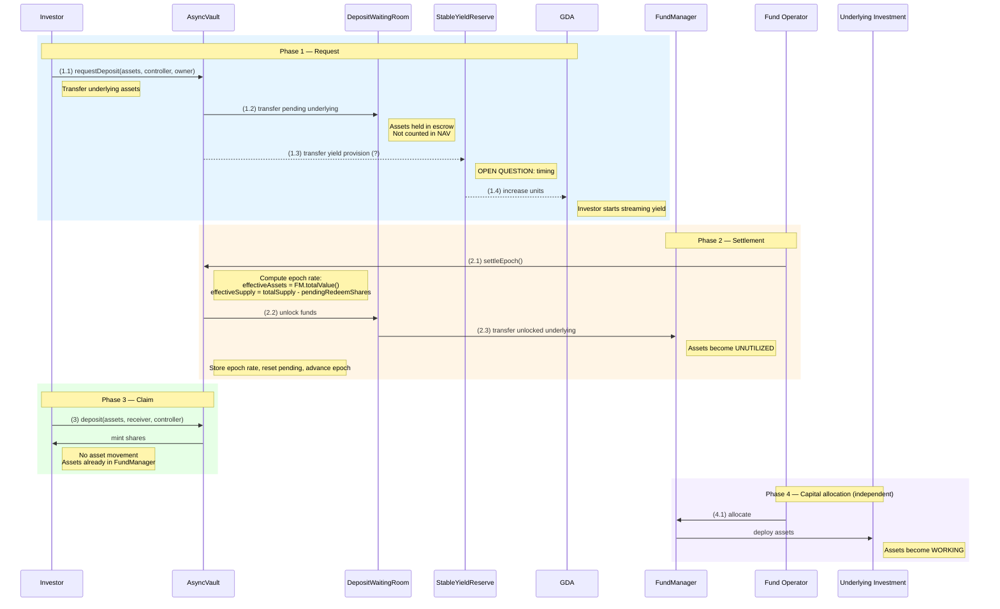

# Investor Deposit Flow (Asynchronous)

## Contracts involved

| Contract | Role |
|---|---|
| **AsyncVault** | Accepts deposit requests, share accounting, orchestrates settlement |
| **DepositWaitingRoom** | Escrows pending deposit assets. Not counted in `totalAssets` |
| **FundManager** | Holds unutilized assets + working asset receipts. Sole source of NAV |
| **StableYieldReserve** | Manages GDA yield distribution, updates units |
| **GDA** | Superfluid General Distribution Agreement — streams yield to unit holders |
| **Fund Operator** | EOA/bot that triggers epoch settlement and capital allocation |

## Asset states

| State | Location | Description |
|---|---|---|
| ASSETS | Investor wallet | Underlying tokens held by the investor |
| DEPOSITING ASSETS | DepositWaitingRoom | Pending deposit, awaiting epoch settlement. Not part of NAV |
| UNUTILIZED ASSETS | FundManager | Settled assets, not yet deployed to investment |
| WORKING ASSETS | Underlying Investment | Deployed capital, generating yield (onchain or offchain) |

## Sequence diagram



## Flow

### Phase 1: Request

```
(1.1) Investor → AsyncVault: requestDeposit(assets, controller, owner)
      - Underlying assets transferred from investor to AsyncVault
      - AsyncVault accrues pending deposit for controller
      - totalPendingDepositAssets increased

(1.2) AsyncVault → DepositWaitingRoom: transfer pending underlying
      - Assets moved from AsyncVault to DepositWaitingRoom
      - These assets are NOT counted in totalAssets / NAV
      - They are held in escrow until epoch settlement

(1.3) AsyncVault → StableYieldReserve: transfer yield provision (?)
      - A fraction of the deposit (annualized yield) is sent to
        StableYieldReserve to fund the GDA stream
      - OPEN QUESTION: timing of this step — see open-questions.md #2
        (may happen at request time, settlement time, or claim time)

(1.4) StableYieldReserve → GDA: increase units
      - Controller's GDA units are increased
      - Investor begins receiving streaming yield
      - OPEN QUESTION: same timing dependency as (1.3)
```

### Phase 2: Settlement

Triggered by the Fund Operator calling `settleEpoch()` on AsyncVault.

```
(2.1) Fund Operator → AsyncVault: settleEpoch()
      - AsyncVault computes the epoch rate:
        effectiveAssets = FundManager.totalValue()
        effectiveSupply = totalSupply() - totalPendingRedeemShares
        epochRate = effectiveAssets / effectiveSupply
      - DepositWaitingRoom assets are excluded from rate computation
        (no shares have been minted for these deposits yet)

(2.2) AsyncVault → DepositWaitingRoom: unlock funds
      - AsyncVault instructs DepositWaitingRoom to release the
        pending deposit assets for this epoch

(2.3) DepositWaitingRoom → FundManager: transfer unlocked underlying
      - Deposit assets move to FundManager as UNUTILIZED ASSETS
      - NOTE: In a mixed deposit/redeem epoch, some of these assets
        may flow to RedeemClaimingRoom instead (netting — see settlement-flow.md)

      AsyncVault stores the epoch rate, resets pending totals, advances epoch.
```

### Phase 3: Claim

```
(3) Investor → AsyncVault: deposit(assets, receiver, controller)
    or mint(shares, receiver, controller)
    - Lazy settlement resolves pending → claimable if needed
    - Pending deposit assets are converted to claimable shares
      at the epoch rate from when the request was settled
    - AsyncVault mints shares to receiver
    - No asset movement at this step (assets already moved during settlement)
```

### Phase 4: Capital allocation (independent of settlement)

```
(4.1) Fund Operator → FundManager: allocate
      - Operator deploys unutilized assets into the underlying investment
      - Can be onchain (via an adapter interface exposing deposit/withdraw)
        or offchain (operator withdraws from FundManager and invests manually)
      - Assets transition from UNUTILIZED to WORKING
      - This step is decoupled from epoch settlement — operator decides
        when and how much to allocate
```

## ERC-7540 compliance

- `requestDeposit` transfers assets from the investor (ERC-7540 compliant)
- Assets are forwarded to DepositWaitingRoom — internal implementation detail,
  invisible to the ERC-7540 interface
- `deposit`/`mint` claim shares from claimable requests without transferring
  assets (assets were already transferred on requestDeposit)
- `pendingDepositRequest` returns pending assets for a controller
- `claimableDepositRequest` returns claimable assets (converted from internal
  claimable shares at the last settled rate)

## Key invariants

1. **DepositWaitingRoom assets are never counted in NAV.**
   They are pending inflows that haven't generated shares yet.

2. **Epoch rate is computed solely from FundManager.totalValue() / effectiveSupply.**
   Clean separation between pending flows and settled capital.

3. **Shares are minted at claim time, not settlement time** (per ERC-7540).
   The epoch rate is locked at settlement; the actual minting happens when
   the investor calls deposit/mint.

4. **Forward pricing:** all deposit requests within an epoch receive the same
   exchange rate, determined at settlement.
