# Investor Deposit Flow (Asynchronous)

## Contracts involved

| Contract | Role |
|---|---|
| **StableYieldAsyncVault** | ERC-7540 vault. Accepts deposit requests, custodies pending deposit assets, mints shares at claim time |
| **FundManager** | Holds unutilized assets (as super-token), reports NAV, drives epoch settlement, operates the GDA pool |
| **GDA Pool** | Superfluid pool owned by the FundManager. Streams yield (in super-token) to unit holders |
| **Fund Operator** | EOA/bot holding `FUND_OPERATOR_ROLE`. Triggers epoch settlement and manages capital in/out of the FundManager |

Note: `DepositWaitingRoom` and `StableYieldReserve` are no longer separate contracts. The vault itself escrows pending deposit assets, and the FundManager owns the GDA pool.

## Asset states

| State | Location | Description |
|---|---|---|
| ASSETS | Investor wallet | Underlying tokens held by the investor |
| PENDING DEPOSIT ASSETS | StableYieldAsyncVault | Pending deposits awaiting settlement. Tracked by `totalPendingDepositAssets`. Not part of NAV |
| UNUTILIZED ASSETS | FundManager (super-token) | Settled assets available to cover redeems or be taken out for investment. Equals `unutilizedAssetsBalance()` |
| WORKING ASSETS | External investment | Assets taken out of the FundManager (via `take`) and deployed; reported back to `closeEpoch` as `workingAssets` |

## Sequence diagram

```mermaid
sequenceDiagram
    participant I as Investor
    participant AV as StableYieldAsyncVault
    participant FM as FundManager
    participant POOL as GDA Pool
    participant FO as Fund Operator
    participant INV as External Investment

    rect rgb(230, 245, 255)
    Note over I, AV: Phase 1 — Request
    I->>AV: (1.1) requestDeposit(assets, controller, owner)
    Note right of I: Transfer underlying to vault
    Note right of AV: Custody in vault balance<br/>totalPendingDepositAssets += assets<br/>Not part of NAV<br/>No GDA units granted yet (D2)
    end

    rect rgb(255, 245, 230)
    Note over FO, AV: Phase 2 — closeEpoch (snapshot & lock)
    FO->>FM: (2.1) closeEpoch(workingAssets)
    FM->>AV: closeEpoch(workingAssets + unutilizedAssetsBalance())
    Note right of AV: Snapshot pending flows<br/>Lock epoch rate = totalFundAssets / effectiveSupply<br/>Advance currentEpoch (new requests rejected while snapshot open)
    end

    rect rgb(255, 245, 230)
    Note over FO, POOL: Phase 3 — settleEpoch (net flows)
    FO->>FM: (3.1) settleEpoch()
    FM->>AV: settleEpoch()
    Note right of AV: Uses locked snapshot
    alt depositing >= redeeming
        AV->>FM: (3.2) transfer surplus = depositing - redeeming
        Note right of FM: Wrap arriving underlying into super-token
    else depositing < redeeming
        Note right of AV: No deposit-side asset movement in this branch
    end
    FM->>POOL: (3.3) FM.units += depositingAssets (scaled)<br/>recalibrate flow rate
    end

    rect rgb(230, 255, 230)
    Note over I, POOL: Phase 4 — Claim
    I->>AV: (4.1) deposit(assets, receiver, controller)<br/>or mint(shares, receiver, controller)
    Note right of AV: Lazy-settle pending → claimable at epoch rate<br/>Mint shares to receiver (no asset movement)
    AV->>FM: (4.2) onClaimDeposit(receiver, assets)
    FM->>POOL: Transfer units from FM → receiver
    Note right of POOL: Investor now receives the yield stream
    end

    rect rgb(245, 240, 255)
    Note over FO, INV: Operator capital management (independent of settlement)
    FO->>FM: take(amount)  %% pull underlying out to deploy
    FM->>FO: underlying
    FO->>INV: deploy
    INV-->>FO: returns / rewards
    FO->>FM: give(amount)  %% return underlying to FM
    end
```



## Flow

### Phase 1: Request

```
(1.1) Investor → Vault: requestDeposit(assets, controller, owner)
      - Reverts if a settlement is in progress (snapshot.epoch != 0)
      - Reverts if assets == 0
      - msg.sender must be owner or an approved operator of owner
      - Lazy-settles any prior pending deposit this controller has from a settled epoch
      - Transfers `assets` from owner → vault (vault custodies directly)
      - totalPendingDepositAssets += assets
      - _pendingDepositRequest[controller] += assets
      - _depositRequestEpoch[controller] = currentEpoch
      - Emits DepositRequest; returns requestId = 0
```

No GDA units are granted at this step. Per design decision D2, the yield stream
commences at claim time, not at request time.

### Phase 2: closeEpoch (snapshot & lock)

```
(2.1) Operator → FundManager: closeEpoch(workingAssets)
      - Only callable by an account with FUND_OPERATOR_ROLE
      - FM computes totalFundAssets = workingAssets + unutilizedAssetsBalance()
      - FM calls Vault.closeEpoch(totalFundAssets)
      - Vault reverts if totalFundAssets == 0 (total-loss scenarios rejected)
      - Vault reverts if the previous snapshot has not been settled
      - Vault computes effectiveSupply
            = totalSupply + _unclaimedDepositShares - _unclaimedRedeemShares
        (phantom shares for settled-but-unclaimed deposits are added;
         dead shares still in totalSupply for settled-but-unclaimed redeems
         are subtracted)
      - Vault locks epoch rate
            = effectiveSupply == 0 ? 1e18 : totalFundAssets * 1e18 / effectiveSupply
      - Vault snapshots
            { epoch, depositingAssets, redeemingShares, rate }
      - Vault zeroes totalPendingDepositAssets and totalPendingRedeemShares
      - Vault increments currentEpoch (new requests land in the next epoch)
      - While a snapshot is open, requestDeposit / requestRedeem revert
        with EPOCH_SETTLEMENT_IN_PROGRESS
```

### Phase 3: settleEpoch (net flows & credit units)

```
(3.1) Operator → FundManager: settleEpoch()
      - Only callable by an account with FUND_OPERATOR_ROLE
      - FM reads the snapshot from the vault (must be read before the vault
        deletes it inside settleEpoch)
      - FM snapshots its underlying balance, then calls Vault.settleEpoch()

      Inside Vault.settleEpoch():
        - redeemingAssets = snap.redeemingShares * snap.rate / 1e18
        - totalClaimableRedeemAssets += redeemingAssets   (earmark in vault)
        - If depositing >= redeeming:
            surplus = depositing - redeeming
            vault.safeTransfer(fundManager, surplus)       (3.2)
          Else:
            deficit = redeeming - depositing
            fundManager.move(vault, deficit)
              → FM downgrades super-token and transfers underlying to vault
        - _unclaimedDepositShares += depositing / rate
        - _unclaimedRedeemShares  += redeemingShares
        - _epochRate[settlingEpoch] = rate
        - _epochSettled[settlingEpoch] = true
        - Emit EpochSettled; clear snapshot

      Back in FM.settleEpoch():
        - Any underlying that arrived (net-inflow surplus) is upgraded
          to super-token
        - If snap.depositingAssets > 0:                     (3.3)
            FM grants itself pool units equal to
              depositingAssets * SUPER_TOKEN_SCALE
            Then _recalibrateFlow(): flowRate = totalUnits * annualRate / YEAR
        - _assertInvariant(): superToken.availableBalance must cover
            totalFlowRate * guaranteedFlowDuration
```

The freshly-minted units belong to FM until individual depositors claim. FM
"self-receives" its own unit share of the flow during this interim.

### Phase 4: Claim

```
(4.1) Investor → Vault: deposit(assets, receiver, controller)
      or        mint(shares, receiver, controller)
      or the 2-arg ERC-4626 overloads (msg.sender becomes the controller)
      - msg.sender must be controller or an approved operator
      - Lazy-settles pending → claimable at the settled epoch's rate
      - Reverts with NOTHING_TO_CLAIM if nothing is claimable
      - Proportional deduction from _claimableDepositAssets / _claimableDepositShares
      - Vault mints shares to receiver (no asset movement — assets were
        pushed to FM during settlement, or kept to cover redeems)

(4.2) Vault → FundManager: onClaimDeposit(receiver, assets)
      - FM transfers `assets * SUPER_TOKEN_SCALE` units from its own
        pool slot to `receiver` (no flow-rate change, no totalUnits change)
      - Investor now receives the yield stream in the underlying's super-token
```

### Operator capital management (independent of settlement)

```
FO → FM: take(amount)
      - Downgrades super-token → underlying, transfers to operator
      - Asserts the forward-solvency invariant post-move
      - Used to deploy assets into external / offchain investments
         (these become WORKING assets; their value is reported back via
          workingAssets on the next closeEpoch)

FO → FM: give(amount)
      - Pulls underlying from operator, upgrades to super-token
      - Used to return realized gains / liquidated principal to the FM
```

`take` / `give` are not gated by the settlement lifecycle — the operator can
move capital in/out at any time, provided the forward-solvency invariant holds.

## ERC-7540 compliance

- `requestDeposit` transfers assets from the owner to the vault.
- `deposit` / `mint` (2-arg and 3-arg) consume claimable balances without
  transferring assets — assets were already transferred at request time.
- `pendingDepositRequest` returns the pending assets (zero once the request's
  epoch has been settled; the balance moves to `claimableDepositRequest`).
- `claimableDepositRequest` returns claimable assets, including pending that
  has become claimable by virtue of the epoch having been settled.
- `previewDeposit` / `previewMint` revert — required for async vaults.
- Shares are ERC-20 but non-transferable: `transfer` / `transferFrom` revert
  with `SHARES_NON_TRANSFERABLE`.

## Key invariants

1. **Vault underlying balance partition.** At quiescent state,
   `underlyingAsset.balanceOf(vault) == totalPendingDepositAssets + totalClaimableRedeemAssets`.
   Pending deposit assets and claimable redeem assets coexist in the vault's
   balance; the two counters keep them separable.

2. **Pending deposit assets are not counted in NAV.** `closeEpoch` prices the
   epoch using `totalFundAssets` (working + unutilized at the FM) and
   `effectiveSupply`, both of which exclude pending deposits.

3. **effectiveSupply correction.** `effectiveSupply = totalSupply +
   unclaimedDepositShares − unclaimedRedeemShares`. This corrects for the lag
   between settlement (assets move) and claim (shares mint/burn).

4. **Rate is locked at closeEpoch.** All requests in a given epoch settle at
   the same `assetsPerShare` (forward pricing).

5. **Shares mint at claim time, not settlement time** (ERC-7540).

6. **Stream starts at claim time** (D2). Units are transferred from FM to the
   controller only when they call `deposit` / `mint`.

7. **Settlement serialized.** Between `closeEpoch` and `settleEpoch`, new
   `requestDeposit` / `requestRedeem` calls revert with
   `EPOCH_SETTLEMENT_IN_PROGRESS`. A previous epoch must be settled before a
   new one can close.
