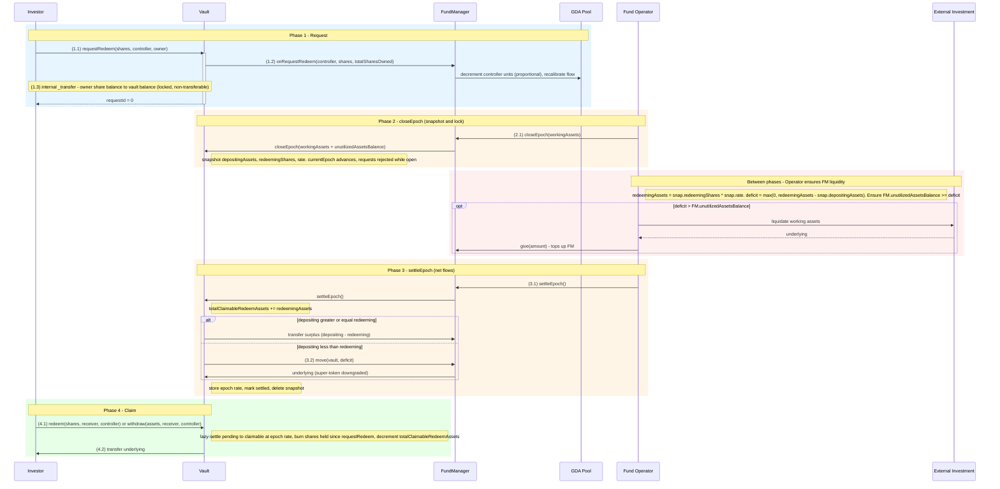

# Investor Redeem Flow (Asynchronous)

## Contracts involved

| Contract | Role |
|---|---|
| **StableYieldAsyncVault** | Accepts redeem requests, custodies locked shares & claimable-redeem assets, releases underlying to claimants |
| **FundManager** | Holds unutilized assets, supplies underlying to the vault on net-outflow settlements, adjusts GDA units |
| **GDA Pool** | Superfluid pool owned by the FundManager. Units are decremented on `requestRedeem` and the flow recalibrates downward |
| **Fund Operator** | EOA/bot holding `FUND_OPERATOR_ROLE`. Ensures FM liquidity and triggers epoch settlement |

Note: `RedeemClaimingRoom` is no longer a separate contract. The vault itself earmarks claimable-redeem assets in its own balance using `totalClaimableRedeemAssets`.

## Asset states

| State | Location | Description |
|---|---|---|
| SHARES | Investor wallet | Vault shares held by the investor. **Non-transferable** (can only be burned via redeem) |
| PENDING REDEEM SHARES | StableYieldAsyncVault | Shares transferred to the vault on `requestRedeem`, awaiting settlement |
| CLAIMABLE REDEEM ASSETS | StableYieldAsyncVault | Underlying earmarked inside vault balance; tracked by `totalClaimableRedeemAssets` |
| ASSETS | Investor wallet | Underlying tokens returned to the investor on claim |

## Sequence diagram



## Flow

### Phase 1: Request

```
(1.1) Investor → Vault: requestRedeem(shares, controller, owner)
      - Reverts if shares == 0
      - Reverts if a settlement is in progress (EPOCH_SETTLEMENT_IN_PROGRESS)
      - Reverts if FundManager has not been wired (FUND_MANAGER_NOT_SET)
      - msg.sender must be owner or an approved operator of owner
      - Lazy-settles any prior pending redeem from a settled epoch

(1.2) Vault → FundManager: onRequestRedeem(controller, shares, totalSharesOwned)
      - totalSharesOwned = balanceOf(owner) BEFORE the share lock
        (used as the denominator for the proportional unit decrement)
      - FM computes delta
            if sharesRedeemed == totalSharesOwned: delta = userUnits (full exit)
            else:                                  delta = userUnits * sharesRedeemed / totalSharesOwned
      - FM decrements controller's pool units by `delta`
      - FM recalibrates flow: totalUnits decreases → flowRate decreases
      - Emits UnitsTransferred

(1.3) Vault transfers shares owner → vault via the internal ERC-20 path
      (external `transfer` is disabled by design D6)
      - totalPendingRedeemShares += shares
      - _pendingRedeemRequest[controller] += shares
      - _redeemRequestEpoch[controller] = currentEpoch
      - Emits RedeemRequest; returns requestId = 0
```

Units are decremented at request time (per D2 / D3). The investor stops
accruing yield immediately upon `requestRedeem`.

### Phase 2: closeEpoch (snapshot & lock)

See `deposit-flow.md` — closeEpoch is symmetric for deposits and redeems.
After this call, the exact `redeemingAssets` is known:

```
redeemingAssets = snapshot.redeemingShares * snapshot.rate / 1e18
deficit         = max(0, redeemingAssets − snapshot.depositingAssets)
```

No estimation needed. No race conditions with new requests (they revert
until settleEpoch).

### Between phases: Operator ensures FM liquidity

```
If deficit > FM.unutilizedAssetsBalance():
  - Operator liquidates working assets (offchain, or via an adapter)
  - Returns underlying to FM via FM.give(amount) — wraps to super-token
  - Ensures FM.unutilizedAssetsBalance() >= deficit before settleEpoch

With the snapshot locked, the deficit is exact — no buffer / over-provisioning
is needed beyond the guaranteedFlowDuration invariant FM enforces on itself.
```

### Phase 3: settleEpoch (net flows)

```
(3.1) Operator → FundManager: settleEpoch()
      - Only callable by an account with FUND_OPERATOR_ROLE
      - FM calls Vault.settleEpoch()

      Inside Vault.settleEpoch():
        - redeemingAssets = snap.redeemingShares * snap.rate / 1e18
        - totalClaimableRedeemAssets += redeemingAssets    (vault-side earmark)
        - If depositing >= redeeming:
            surplus → FM (vault.safeTransfer)
          Else:                                             (3.2)
            deficit = redeemingAssets - depositing
            fundManager.move(vault, deficit)
              → FM downgrades super-token, transfers underlying to vault
              → FM asserts forward-solvency invariant
        - _unclaimedRedeemShares += redeemingShares
          (shares are still in totalSupply but no longer back NAV)
        - _epochRate[settlingEpoch] = rate
        - _epochSettled[settlingEpoch] = true
        - Delete snapshot
```

No unit manipulation happens on the redeem side during settleEpoch — the
units were already removed at request time.

### Phase 4: Claim

```
(4.1) Investor → Vault: redeem(shares, receiver, controller)
      or         withdraw(assets, receiver, controller)
      or the 2-arg ERC-4626 overloads (msg.sender becomes the controller)
      - msg.sender must be controller or an approved operator
      - Lazy-settles pending → claimable at the settled rate
      - Reverts with NOTHING_TO_CLAIM if nothing claimable

      Proportional deduction:
        redeem(shares, …)   → assets = shares * claimableAssets / claimableShares
        withdraw(assets, …) → shares = ceil(assets * claimableShares / claimableAssets)
                              (rounded up so at least 1 share is burned)

      - _claimableRedeemShares[controller] -= shares
      - _claimableRedeemAssets[controller] -= assets
      - _unclaimedRedeemShares -= shares
      - totalClaimableRedeemAssets -= assets
      - Burn `shares` from the vault (held since requestRedeem)

(4.2) Vault → receiver: underlyingAsset.safeTransfer(receiver, assets)
      - Paid out of the vault's earmarked balance
```

## ERC-7540 compliance

- `requestRedeem` transfers shares from the owner to the vault.
- `redeem` / `withdraw` (2-arg and 3-arg) consume claimable balances,
  burn the held shares, and release underlying from the vault's earmark.
- `pendingRedeemRequest` returns pending shares (zero once the request's
  epoch has been settled).
- `claimableRedeemRequest` returns claimable shares, including pending that
  has become claimable by virtue of the epoch having been settled.
- `previewRedeem` / `previewWithdraw` revert — required for async vaults.

## Key invariants

1. **Vault balance partition.** At quiescent state,
   `underlyingAsset.balanceOf(vault) == totalPendingDepositAssets + totalClaimableRedeemAssets`.
   Claimants can only be paid from the `totalClaimableRedeemAssets` side of
   that partition. The operator has no pathway to touch these assets.

2. **settleEpoch reverts if the FM cannot cover the deficit.**
   `FM.move` downgrades super-token; if the super-token balance is
   insufficient after accounting for the forward-solvency requirement, the
   call reverts. All requests in an epoch settle atomically — no partial
   settlement.

3. **Unit removal at request time.** Investors stop streaming yield on
   `requestRedeem`, not on claim. This prevents a redeeming investor from
   continuing to accrue yield during the settlement window.

4. **Once closeEpoch is called, settleEpoch must follow.** No rollback.
   Requests in the closed epoch are frozen until `settleEpoch` completes.

5. **Shares are burned at claim time** (ERC-7540), not at settlement.
   `_unclaimedRedeemShares` tracks shares still in `totalSupply` whose
   backing assets have already left NAV — `closeEpoch` subtracts them from
   `effectiveSupply` to keep pricing consistent.

6. **Forward pricing.** All redeem requests in a given epoch receive the
   same `assetsPerShare`, locked at `closeEpoch`.

7. **Shares are non-transferable** (D6). The only way out is `requestRedeem`
   → `redeem`/`withdraw`.
