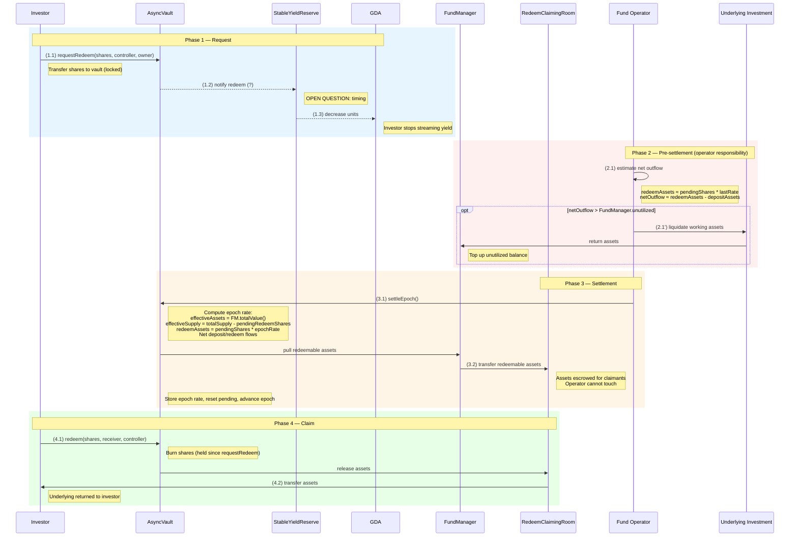

# Investor Redeem Flow (Asynchronous)

## Contracts involved

| Contract | Role |
|---|---|
| **AsyncVault** | Accepts redeem requests, share accounting, orchestrates settlement |
| **RedeemClaimingRoom** | Escrows redeemable assets post-settlement. Only claimants can withdraw |
| **FundManager** | Holds unutilized assets + working asset receipts. Sole source of NAV |
| **StableYieldReserve** | Manages GDA yield distribution, updates units |
| **GDA** | Superfluid General Distribution Agreement — streams yield to unit holders |
| **Fund Operator** | EOA/bot that ensures liquidity and triggers epoch settlement |

## Asset states

| State | Location | Description |
|---|---|---|
| SHARES | Investor wallet | Vault shares held by the investor |
| REDEEMING SHARES | AsyncVault | Shares locked in vault, awaiting settlement |
| REDEEMABLE ASSETS | RedeemClaimingRoom | Assets available for investor to claim anytime |
| ASSETS | Investor wallet | Underlying tokens returned to investor |

## Sequence diagram



## Flow

### Phase 1: Request

```
(1.1) Investor → AsyncVault: requestRedeem(shares, controller, owner)
      - Shares transferred from investor to AsyncVault (locked)
      - AsyncVault accrues pending redeem for controller
      - totalPendingRedeemShares increased

(1.2) AsyncVault → StableYieldReserve: notify redeem (?)
      - StableYieldReserve is notified of the redeem request
      - OPEN QUESTION: timing of this step — see open-questions.md #2
        (may happen at request time, settlement time, or claim time)

(1.3) StableYieldReserve → GDA: decrease units
      - Controller's GDA units are decreased
      - Investor stops receiving streaming yield
      - OPEN QUESTION: same timing dependency as (1.2)
```

### Phase 2: Pre-settlement (operator responsibility)

```
(2.1) Fund Operator estimates net outflows:
      - estimatedRedeemAssets ≈ totalPendingRedeemShares * lastSettledRate
      - netOutflow ≈ estimatedRedeemAssets - totalPendingDepositAssets
      - This is an estimate — the actual epoch rate is computed during settlement
        and may differ slightly from the last settled rate
      - Operator should include a small buffer to account for rate variance

(2.1') If netOutflow > FundManager.unutilizedBalance:
       - Operator liquidates working assets from the underlying investment
         (onchain via adapter, or offchain)
       - May take time for illiquid positions
       - Operator deposits liquidated assets back into FundManager
       - Ensures FundManager.unutilized >= estimated netOutflow + buffer
```

### Phase 3: Settlement

Triggered by the Fund Operator calling `settleEpoch()` on AsyncVault.

```
(3.1) Fund Operator → AsyncVault: settleEpoch()
      - AsyncVault computes the epoch rate:
        effectiveAssets = FundManager.totalValue()
        effectiveSupply = totalSupply() - totalPendingRedeemShares
        epochRate = effectiveAssets / effectiveSupply
      - Converts pending redeems to asset terms:
        redeemAssets = totalPendingRedeemShares * epochRate
      - Nets deposit and redeem flows (see settlement-flow.md for details)

(3.2) FundManager → RedeemClaimingRoom: transfer redeemable assets
      - Orchestrated by AsyncVault during settleEpoch
      - The total redeemable amount is transferred to RedeemClaimingRoom
      - In a mixed epoch, some of this may come from DepositWaitingRoom
        (netting) and the remainder from FundManager
      - Reverts if FundManager cannot cover the net outflow

      AsyncVault stores the epoch rate, resets pending totals, advances epoch.
```

### Phase 4: Claim

```
(4.1) Investor → AsyncVault: redeem(shares, receiver, controller)
      or withdraw(assets, receiver, controller)
      - Lazy settlement resolves pending → claimable if needed
      - Pending redeem shares are converted to claimable assets
        at the epoch rate from when the request was settled
      - AsyncVault burns shares (held in vault since requestRedeem)

(4.2) RedeemClaimingRoom → Investor: transfer assets
      - Orchestrated by AsyncVault as part of the redeem/withdraw call
      - RedeemClaimingRoom releases the corresponding assets to receiver
      - Only the rightful claimant (controller or approved operator)
        can trigger this via AsyncVault
```

## ERC-7540 compliance

- `requestRedeem` transfers shares from the investor to the vault (ERC-7540 compliant)
- `redeem`/`withdraw` claim assets from claimable requests
  (shares were already transferred on requestRedeem, burned at claim time)
- Assets are released from RedeemClaimingRoom — internal implementation detail,
  invisible to the ERC-7540 interface
- `pendingRedeemRequest` returns pending shares for a controller
- `claimableRedeemRequest` returns claimable shares (converted from internal
  claimable assets at the last settled rate)

## Key invariants

1. **RedeemClaimingRoom balance >= sum of all claimable redeem assets.**
   The operator cannot touch these funds. Only claimants can withdraw.

2. **settleEpoch reverts if FundManager cannot cover the net outflow.**
   All requests in an epoch settle together — no partial settlement.

3. **Shares are burned at claim time, not settlement time** (per ERC-7540).
   Shares remain locked in the vault between settlement and claim.

4. **Epoch rate is computed solely from FundManager.totalValue() / effectiveSupply.**
   RedeemClaimingRoom and DepositWaitingRoom assets are excluded from NAV.

5. **Forward pricing:** all redeem requests within an epoch receive the same
   exchange rate, determined at settlement.
