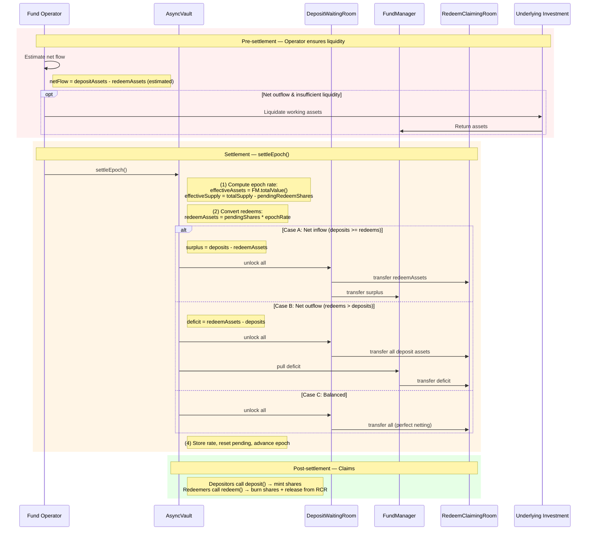

# Epoch Settlement Flow (Combined Deposit + Redeem)

## Contracts involved

| Contract | Holds |
|---|---|
| **AsyncVault** | Redeeming shares (locked), share accounting |
| **WaitingRoom** | Pending deposit assets |
| **RedeemClaimingRoom** | Redeemable assets (post-settlement, for claimants) |
| **FundManager** | Unutilized assets + working asset receipts (= NAV) |
| **StableYieldReserve** | Yield distribution via GDA (timing TBD) |

## Sequence diagram



## Pre-settlement (operator responsibility)

```
(0.1) Operator estimates net flow:
      - estimatedRedeemAssets ≈ totalPendingRedeemShares * lastSettledRate
      - netFlow = totalPendingDepositAssets - estimatedRedeemAssets
      - If netFlow < 0 (net outflow):
          Operator liquidates investments and tops up FundManager
          so that FundManager.unutilized >= |netFlow|
```

## Settlement: settleEpoch()

Called by the operator on AsyncVault. The vault orchestrates all fund movements.

```
(1) Compute epoch rate:
    - effectiveAssets = FundManager.totalValue()
    - effectiveSupply = totalSupply() - totalPendingRedeemShares
    - epochRate = effectiveAssets / effectiveSupply
    (If no shares exist, epochRate = 1:1)

(2) Convert pending redeems to asset terms:
    - redeemAssets = totalPendingRedeemShares * epochRate

(3) Net and move funds:

    Case A: Net inflow (totalPendingDepositAssets >= redeemAssets)
    ┌─────────────────────────────────────────────────────────┐
    │  surplus = totalPendingDepositAssets - redeemAssets      │
    │                                                         │
    │  WaitingRoom ──(redeemAssets)──→ RedeemClaimingRoom     │
    │  WaitingRoom ──(surplus)──────→ FundManager             │
    └─────────────────────────────────────────────────────────┘
    Deposit assets fully cover redemptions.
    Excess goes to FundManager as unutilized capital.

    Case B: Net outflow (redeemAssets > totalPendingDepositAssets)
    ┌─────────────────────────────────────────────────────────┐
    │  deficit = redeemAssets - totalPendingDepositAssets      │
    │                                                         │
    │  WaitingRoom ──(all deposit assets)──→ RedeemClaimingRoom│
    │  FundManager ──(deficit)─────────────→ RedeemClaimingRoom│
    └─────────────────────────────────────────────────────────┘
    Deposit assets partially cover redemptions.
    FundManager covers the remainder from unutilized assets.
    Reverts if FundManager.unutilized < deficit.

    Case C: Balanced (totalPendingDepositAssets == redeemAssets)
    ┌─────────────────────────────────────────────────────────┐
    │  WaitingRoom ──(all)──→ RedeemClaimingRoom              │
    └─────────────────────────────────────────────────────────┘
    Perfect netting. No FundManager interaction needed.

(4) Store epoch rate, reset pending totals, advance epoch:
    - _epochRate[currentEpoch] = epochRate
    - totalPendingDepositAssets = 0
    - totalPendingRedeemShares = 0
    - currentEpoch++
```

## Post-settlement: Claims

```
Depositors:
  - Investor calls deposit(assets, receiver, controller) on AsyncVault
  - Lazy settlement converts pending assets → claimable shares at epoch rate
  - AsyncVault mints shares to receiver
  - No asset movement (assets already in WaitingRoom → FundManager)

Redeemers:
  - Investor calls redeem(shares, receiver, controller) on AsyncVault
  - Lazy settlement converts pending shares → claimable assets at epoch rate
  - AsyncVault burns shares (held since requestRedeem)
  - AsyncVault instructs RedeemClaimingRoom to release assets to receiver
```

## Netting example

Alice requests deposit: 100 USDC (in WaitingRoom)
Bob requests redeem: 80 shares (worth 80 USDC at epoch rate)
Carol requests redeem: 50 shares (worth 50 USDC at epoch rate)

Total deposits: 100 USDC
Total redeems: 130 USDC
Net outflow: 30 USDC

Settlement:
1. Rate computed from FundManager.totalValue() / effectiveSupply
2. 100 USDC from WaitingRoom → RedeemClaimingRoom
3. 30 USDC from FundManager → RedeemClaimingRoom
4. RedeemClaimingRoom now holds 130 USDC (Bob: 80, Carol: 50)
5. Alice can claim shares from AsyncVault

## Key invariants

1. **RedeemClaimingRoom balance >= sum of all claimable redeem assets.**
   Operator cannot touch these funds.

2. **settleEpoch reverts if FundManager cannot cover net outflow.**
   No partial settlements — all requests in an epoch settle together.

3. **Rate is computed solely from FundManager.totalValue() / effectiveSupply.**
   WaitingRoom and RedeemClaimingRoom assets are excluded from NAV.

4. **Shares are burned at claim time, not settlement time** (per ERC-7540).
