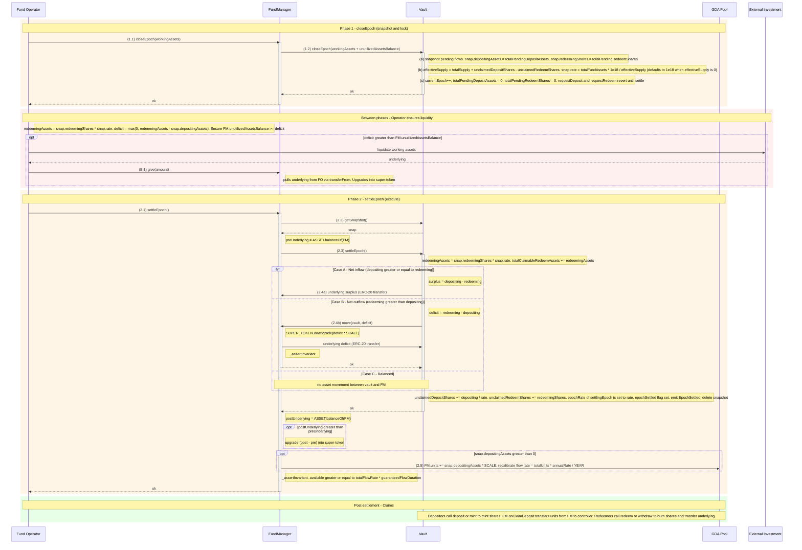

# Epoch Settlement Flow (Combined Deposit + Redeem)

## Contracts involved

| Contract | Holds |
|---|---|
| **StableYieldAsyncVault** | Redeeming shares (locked), pending deposit assets, claimable redeem assets, share accounting |
| **FundManager** | Unutilized assets as super-token (`unutilizedAssetsBalance()`); owner of the GDA pool |
| **GDA Pool** | Units representing yield claims; distributes a flow at `totalUnits * annualRate / YEAR` |

Settlement is **driven by the FundManager**. The operator calls
`FundManager.closeEpoch(workingAssets)` and `FundManager.settleEpoch()`, which
in turn call the corresponding vault entry points. The operator never calls
the vault's settlement functions directly — the vault's `closeEpoch` and
`settleEpoch` are gated by `onlyFundManager`.

## Sequence diagram



## Phase 1: closeEpoch()

Entry point on the **FundManager**; callable only by `FUND_OPERATOR_ROLE`.

```
(A.0) Operator → FM.closeEpoch(workingAssets)
      - `workingAssets` is the operator-reported value of assets currently
        deployed outside the FM (those taken out via FM.take).
      - FM: totalFundAssets = workingAssets + unutilizedAssetsBalance()
      - FM.closeEpoch → Vault.closeEpoch(totalFundAssets)   (onlyFundManager)

Inside Vault.closeEpoch:

(A.1) Reverts if totalFundAssets == 0 (total-loss scenarios rejected).
      Reverts if the previous snapshot is still open.

(A.2) effectiveSupply = totalSupply
                      + _unclaimedDepositShares
                      - _unclaimedRedeemShares

(A.3) snap.rate = effectiveSupply == 0
                  ? 1e18
                  : totalFundAssets * 1e18 / effectiveSupply

(A.4) snap = { epoch: currentEpoch,
               depositingAssets: totalPendingDepositAssets,
               redeemingShares:  totalPendingRedeemShares,
               rate }

(A.5) totalPendingDepositAssets = 0
      totalPendingRedeemShares  = 0
      currentEpoch++
      _lastReportedTotalAssets = totalFundAssets

While `snap.epoch != 0` (i.e. between closeEpoch and settleEpoch), both
requestDeposit and requestRedeem revert with EPOCH_SETTLEMENT_IN_PROGRESS.
```

## Between phases: Operator ensures liquidity

With the snapshot locked, the operator knows the exact deficit:

```
redeemingAssets = snap.redeemingShares * snap.rate / 1e18
deficit         = max(0, redeemingAssets - snap.depositingAssets)

If deficit > FM.unutilizedAssetsBalance():
  Operator liquidates working assets (offchain or via an adapter)
  Returns underlying via FM.give(amount)  → wraps into super-token
  Ensures FM.unutilizedAssetsBalance() >= deficit
```

No buffer is needed — the numbers are exact. The FM's own forward-solvency
invariant (`available >= totalFlowRate * guaranteedFlowDuration`) is still
enforced by `_assertInvariant()` on every FM.move / FM.take / FM.settleEpoch
call; downgrading too much super-token reverts.

## Phase 2: settleEpoch()

Entry point on the **FundManager**; callable only by `FUND_OPERATOR_ROLE`.

```
(B.0) FM.settleEpoch():
      - snap = Vault.getSnapshot()       (read before the vault deletes it)
      - preUnderlying = ASSET.balanceOf(FM)
      - Vault.settleEpoch()              (onlyFundManager)
      - postUnderlying = ASSET.balanceOf(FM)
      - If postUnderlying > preUnderlying:
          FM upgrades the arrived delta into super-token
      - If snap.depositingAssets > 0:
          FM self-grants pool units = snap.depositingAssets * SUPER_TOKEN_SCALE
          _recalibrateFlow(): rate = totalUnits * annualRate / YEAR
      - _assertInvariant(): available >= totalFlowRate * guaranteedFlowDuration

Inside Vault.settleEpoch:

(B.1) settlingEpoch = snap.epoch; revert if zero.

(B.2) redeemingAssets = snap.redeemingShares * snap.rate / 1e18
      totalClaimableRedeemAssets += redeemingAssets

(B.3) Net flows (only one of three paths runs):

    Case A: Net inflow (depositingAssets >= redeemingAssets)
    ┌──────────────────────────────────────────────────────────┐
    │  surplus = depositingAssets - redeemingAssets             │
    │  vault  ─(surplus)→ FundManager                           │
    │  (vault retains `redeemingAssets` as claimable earmark)   │
    └──────────────────────────────────────────────────────────┘

    Case B: Net outflow (redeemingAssets > depositingAssets)
    ┌──────────────────────────────────────────────────────────┐
    │  deficit = redeemingAssets - depositingAssets             │
    │  FM.move(vault, deficit)                                  │
    │    → FM downgrades super-token                            │
    │    → vault receives underlying                            │
    └──────────────────────────────────────────────────────────┘

    Case C: Balanced (depositingAssets == redeemingAssets)
    ┌──────────────────────────────────────────────────────────┐
    │  No asset movement between vault and FM                   │
    │  (the vault's pending-deposit balance becomes the         │
    │   claimable-redeem earmark, in-place)                     │
    └──────────────────────────────────────────────────────────┘

(B.4) Commit lag-correction counters and epoch rate:
      _unclaimedDepositShares += depositingAssets * 1e18 / rate
      _unclaimedRedeemShares  += redeemingShares
      _epochRate[settlingEpoch] = rate
      _epochSettled[settlingEpoch] = true
      emit EpochSettled
      delete snapshot
```

## Post-settlement: Claims

Only possible once the epoch is **settled** (not just closed).

```
Depositors:
  - deposit(assets, receiver, controller) / mint(shares, receiver, controller)
  - Lazy settlement converts pending → claimable at epoch rate
  - Vault mints shares to receiver (no asset movement)
  - FM.onClaimDeposit(receiver, assets) transfers pool units FM → receiver
      (totalUnits unchanged; flowRate unchanged; yield now streams to receiver)

Redeemers:
  - redeem(shares, receiver, controller) / withdraw(assets, receiver, controller)
  - Lazy settlement converts pending → claimable at epoch rate
  - Vault burns the shares it held since requestRedeem
  - Vault transfers underlying from its balance to receiver
  - totalClaimableRedeemAssets decreases accordingly
```

## Netting example

Alice requests deposit: 100 USDC
Bob   requests redeem : 80 shares
Carol requests redeem : 50 shares

Assume rate at close is 1 share = 1 USDC (1e18).

**closeEpoch(workingAssets):**
1. totalFundAssets = workingAssets + FM.unutilizedAssetsBalance()
2. snap = { depositingAssets: 100, redeemingShares: 130, rate: 1e18 }
3. redeemingAssets = 130 USDC
4. deficit = 130 − 100 = 30 USDC
5. currentEpoch advances; new requests revert until settle

**Between phases:**
6. Operator checks `FM.unutilizedAssetsBalance() >= 30`. If not, liquidates
   30 USDC of working assets and tops up via `FM.give(30)`.

**settleEpoch:**
7. Vault: totalClaimableRedeemAssets += 130
8. Case B (deficit): `FM.move(vault, 30)` — FM downgrades 30 of super-token
   and sends 30 USDC to the vault
9. Vault now holds 100 (Alice's original deposit) + 30 (moved from FM)
   = 130 USDC, exactly matching the 130 earmarked for Bob+Carol
10. FM self-grants `100 * SUPER_TOKEN_SCALE` units for Alice's not-yet-claimed
    deposit, and recalibrates the flow upward

**Post-settlement:**
11. Alice claims via `deposit` / `mint` → shares minted, units transferred
    FM → Alice, her stream commences
12. Bob and Carol claim via `redeem` / `withdraw` → shares burned, underlying
    released from vault to them

## Key invariants

1. **Vault balance partition.**
   `underlyingAsset.balanceOf(vault) == totalPendingDepositAssets + totalClaimableRedeemAssets`
   at quiescent state. The operator cannot touch the claimable-redeem earmark.

2. **settleEpoch reverts if FM cannot cover the deficit.**
   `FM.move` downgrades super-token; `_assertInvariant` reverts if the
   remaining available balance would break the forward-solvency horizon.
   No partial settlement — all requests in an epoch settle together.

3. **Once closeEpoch is called, settleEpoch must follow.** No rollback.
   A new epoch cannot close until the previous one is settled.

4. **Rate uses effective supply.**
   `rate = totalFundAssets / (totalSupply + unclaimedDepositShares − unclaimedRedeemShares)`
   The lag-correction counters ensure unsettled / settled-but-unclaimed
   positions don't double-count or drop out of pricing.

5. **Shares mint / burn at claim time**, not settlement (per ERC-7540).

6. **Claims are only possible after settleEpoch**, not just closeEpoch.

7. **GDA unit transitions.**
   - Redeem: units decrement at `requestRedeem` (from controller);
     flow recalibrates down.
   - Deposit: units increment at `settleEpoch` (self-granted to FM);
     flow recalibrates up.
   - Claim-deposit: units transfer FM → controller at `deposit` / `mint`;
     total units and flow rate unchanged.
