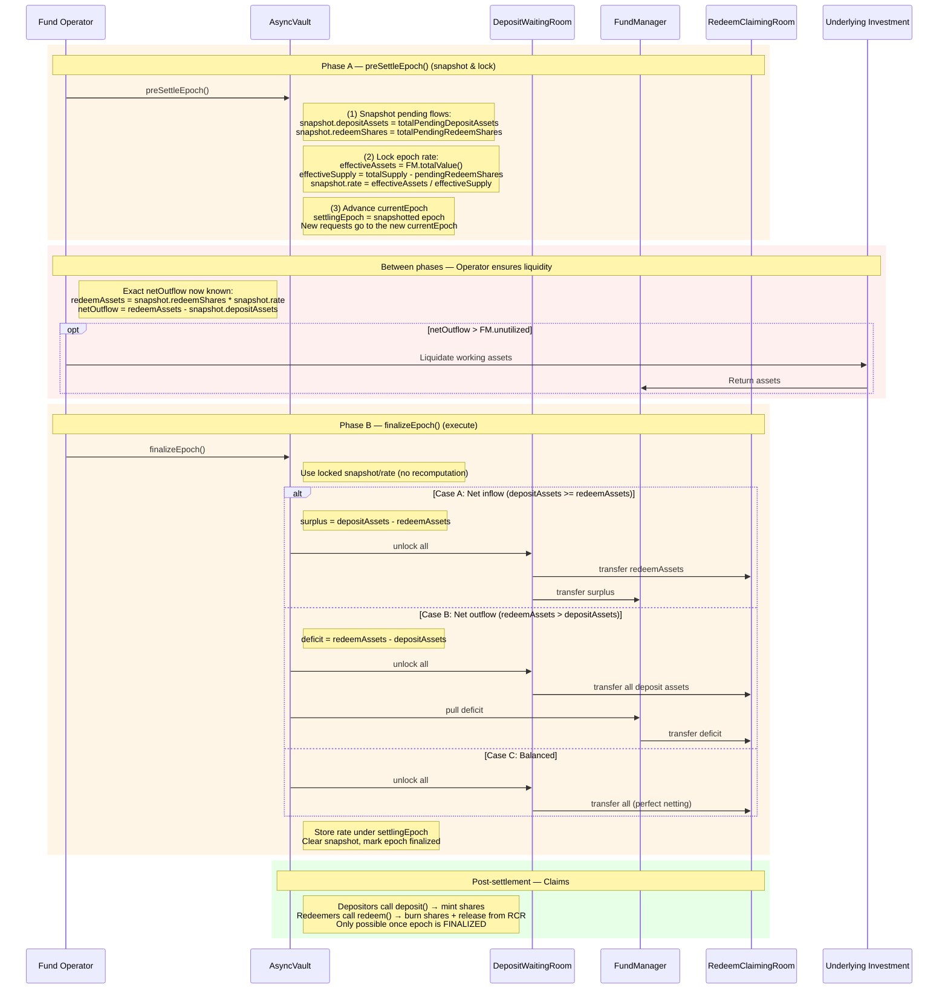

# Epoch Settlement Flow (Combined Deposit + Redeem)

## Contracts involved

| Contract | Holds |
|---|---|
| **AsyncVault** | Redeeming shares (locked), share accounting |
| **WaitingRoom** | Pending deposit assets |
| **RedeemClaimingRoom** | Redeemable assets (post-settlement, for claimants) |
| **FundManager** | Unutilized assets + working asset receipts (= NAV) |
| **StableYieldReserve** | Yield distribution via GDA (timing TBD) |

## Sequence diagram



## Phase A: preSettleEpoch()

Called by the operator on AsyncVault. Takes a snapshot and locks the rate.
No fund movements.

```
(A.1) Snapshot pending flows:
      snapshot.depositAssets = totalPendingDepositAssets
      snapshot.redeemShares  = totalPendingRedeemShares

(A.2) Compute and lock the epoch rate:
      effectiveAssets = FundManager.totalValue()
      effectiveSupply = totalSupply() - totalPendingRedeemShares
      snapshot.rate   = effectiveAssets / effectiveSupply
      (If no shares exist, snapshot.rate = 1:1)

(A.3) Advance currentEpoch so new requests land in the next epoch:
      settlingEpoch = currentEpoch
      currentEpoch++
      totalPendingDepositAssets = 0  // reset for new epoch
      totalPendingRedeemShares  = 0

      Pending requests in settlingEpoch are frozen:
      they cannot be claimed until finalizeEpoch completes.
```

## Between phases: Operator ensures liquidity

With the snapshot locked, the operator knows the EXACT net outflow:

```
redeemAssets = snapshot.redeemShares * snapshot.rate
netOutflow   = redeemAssets - snapshot.depositAssets

If netOutflow > FundManager.unutilized:
  Operator liquidates working assets (onchain or offchain)
  Deposits liquidated assets into FundManager
  Ensures FundManager.unutilized >= netOutflow
```

No buffer needed — the numbers are exact.

## Phase B: finalizeEpoch()

Uses the locked snapshot, nets flows, and moves funds atomically.

```
(B.1) Use the locked snapshot:
      depositAssets = snapshot.depositAssets
      redeemAssets  = snapshot.redeemShares * snapshot.rate

(B.2) Net and move funds:

    Case A: Net inflow (depositAssets >= redeemAssets)
    ┌─────────────────────────────────────────────────────────┐
    │  surplus = depositAssets - redeemAssets                  │
    │                                                         │
    │  DepositWaitingRoom ──(redeemAssets)──→ RedeemClaimingRoom │
    │  DepositWaitingRoom ──(surplus)──────→ FundManager      │
    └─────────────────────────────────────────────────────────┘
    Deposit assets fully cover redemptions.
    Excess goes to FundManager as unutilized capital.

    Case B: Net outflow (redeemAssets > depositAssets)
    ┌─────────────────────────────────────────────────────────┐
    │  deficit = redeemAssets - depositAssets                  │
    │                                                         │
    │  DepositWaitingRoom ──(all deposit assets)──→ RedeemClaimingRoom │
    │  FundManager ──(deficit)────────────────────→ RedeemClaimingRoom │
    └─────────────────────────────────────────────────────────┘
    Deposit assets partially cover redemptions.
    FundManager covers the remainder from unutilized assets.
    Reverts if FundManager.unutilized < deficit.

    Case C: Balanced (depositAssets == redeemAssets)
    ┌─────────────────────────────────────────────────────────┐
    │  DepositWaitingRoom ──(all)──→ RedeemClaimingRoom       │
    └─────────────────────────────────────────────────────────┘
    Perfect netting. No FundManager interaction needed.

(B.3) Finalize the epoch:
      _epochRate[settlingEpoch] = snapshot.rate
      clear snapshot
      mark settlingEpoch as finalized
```

## Post-settlement: Claims

Only possible once the epoch is **finalized** (not just preSettled).

```
Depositors:
  - Investor calls deposit(assets, receiver, controller) on AsyncVault
  - Lazy settlement converts pending assets → claimable shares at epoch rate
  - AsyncVault mints shares to receiver
  - No asset movement (assets already moved during finalizeEpoch)

Redeemers:
  - Investor calls redeem(shares, receiver, controller) on AsyncVault
  - Lazy settlement converts pending shares → claimable assets at epoch rate
  - AsyncVault burns shares (held since requestRedeem)
  - AsyncVault instructs RedeemClaimingRoom to release assets to receiver
```

## Netting example

Alice requests deposit: 100 USDC (in DepositWaitingRoom)
Bob requests redeem: 80 shares
Carol requests redeem: 50 shares

**preSettleEpoch:**
1. Rate locked: snapshot.rate = FundManager.totalValue() / effectiveSupply
2. Snapshot: depositAssets=100, redeemShares=130
3. redeemAssets = 130 * snapshot.rate (e.g. = 130 USDC if rate is 1:1)
4. netOutflow = 130 - 100 = 30 USDC
5. Epoch advances, new requests go to the next epoch

**Between phases:**
6. Operator sees FundManager.unutilized < 30 → liquidates 30 USDC, tops up

**finalizeEpoch:**
7. 100 USDC from DepositWaitingRoom → RedeemClaimingRoom
8. 30 USDC from FundManager → RedeemClaimingRoom
9. RedeemClaimingRoom now holds 130 USDC (Bob: 80, Carol: 50)
10. Epoch is finalized, rate stored

**Post-settlement:**
11. Alice claims her shares from AsyncVault
12. Bob and Carol claim their assets via AsyncVault → RedeemClaimingRoom

## Key invariants

1. **RedeemClaimingRoom balance >= sum of all claimable redeem assets.**
   Operator cannot touch these funds.

2. **finalizeEpoch reverts if FundManager cannot cover net outflow.**
   No partial settlements — all requests in an epoch settle together.

3. **Once preSettleEpoch is called, finalizeEpoch must eventually be called.**
   No rollback. Requests in the snapshotted epoch are frozen until finalize.

4. **Rate is computed solely from FundManager.totalValue() / effectiveSupply,
   and is locked at preSettleEpoch time.**
   DepositWaitingRoom and RedeemClaimingRoom assets are excluded from NAV.

5. **Shares are burned at claim time, not settlement time** (per ERC-7540).

6. **Claims are only possible after finalizeEpoch**, not just preSettleEpoch.
