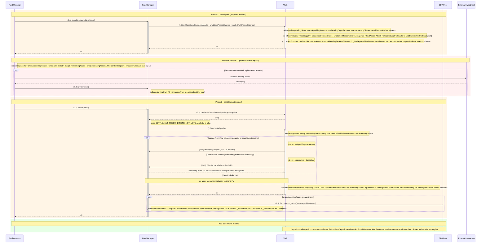

# Epoch Settlement Flow (Combined Deposit + Redeem)

## Contracts involved

| Contract | Holds |
|---|---|
| **StableYieldAsyncVault** | Redeeming shares (locked), pending deposit assets, claimable redeem assets, share accounting |
| **FundManager** | Unutilized underlying (`unutilizedAssetsBalance()`) and a separate yield-asset super-token reserve (`yieldAssetsBalance()`); owner of the GDA pool |
| **GDA Pool** | Units representing yield claims; distributes a flow at `_flowRatePerUnit * totalUnits`, where `_flowRatePerUnit = 1e12 * stableYieldRate / (YEAR * BP_DENOMINATOR)` |

Settlement is **driven by the FundManager**. The operator calls
`FundManager.closeEpoch(workingAssets)` and `FundManager.settleEpoch()`, which
in turn call the vault hooks `onCloseEpoch` and `onSettleEpoch`. The operator
never calls the vault's settlement hooks directly — they are gated by
`onlyFundManager`.

## Sequence diagram



## Phase 1: closeEpoch()

Entry point on the **FundManager**; callable only by `FUND_OPERATOR_ROLE`.

```
(A.0) Operator → FM.closeEpoch(workingAssets)
      - `workingAssets` is the operator-reported value of assets currently
        deployed outside the FM (those taken out via FM.take), in underlying
        decimals.
      - FM:
            totalAssets = workingAssets
                        + unutilizedAssetsBalance()
                        + scaledYieldAssetsBalance()
        The yield-asset reserve is included in NAV alongside the unutilized
        underlying and the working assets.
      - FM.closeEpoch → Vault.onCloseEpoch(totalAssets)   (onlyFundManager)

Inside Vault.onCloseEpoch:

(A.1) Reverts with PREVIOUS_EPOCH_NOT_SETTLED if a snapshot is still open.

(A.2) effectiveSupply = totalSupply
                      + _unclaimedDepositShares
                      - _unclaimedRedeemShares

(A.3) snap.rate = effectiveSupply == 0
                  ? 1e18
                  : totalAssets * 1e18 / effectiveSupply

(A.4) snap = { epoch: currentEpoch,
               depositingAssets: totalPendingDepositAssets,
               redeemingShares:  totalPendingRedeemShares,
               rate }

(A.5) totalPendingDepositAssets = 0
      totalPendingRedeemShares  = 0
      currentEpoch++
      _lastReportedTotalAssets = totalAssets

While `snap.epoch != 0` (i.e. between closeEpoch and settleEpoch), both
requestDeposit and requestRedeem revert with EPOCH_SETTLEMENT_IN_PROGRESS.
```

## Between phases: Operator ensures liquidity

With the snapshot locked, the operator knows the exact deficit:

```
redeemingAssets = snap.redeemingShares * snap.rate / 1e18
deficit         = max(0, redeemingAssets - snap.depositingAssets)
```

The FM exposes view helpers to size the top-up:

- `canSettleEpoch()` returns `(canSettle, reason, snap)`. Reason will be
  `"INSUFFICIENT_ASSETS_IN_FUND_MANAGER"` if the FM cannot cover the deficit
  *plus* the post-settlement yield-asset reserve.
- `evaluateFunding()` returns the signed delta the operator should give
  (positive) or can take (negative) to balance the FM for settlement.
- `evaluateYieldAssetsDeficit()` returns the super-token shortfall against
  `_targetFlowRate * guaranteedFlowDuration` (negative if in excess).

If a top-up is needed, the operator liquidates working assets and calls
`FM.give(amount)`. `give` simply pulls underlying — it does not upgrade
into the yield-asset reserve. Rebalancing into the super-token reserve
happens later inside `settleEpoch` (via `_rebalanceYieldAssets`), via
`ensureYieldFlowDuration`, or whenever the operator changes
`stableYieldRate` or `guaranteedFlowDuration`.

## Phase 2: settleEpoch()

Entry point on the **FundManager**; callable only by `FUND_OPERATOR_ROLE`;
`nonReentrant`.

```
(B.0) FM.settleEpoch():
      - (canSettle, reason, snap) = canSettleEpoch()
      - revert SETTLEMENT_PRECONDITIONS_NOT_MET(reason) if !canSettle.
        canSettleEpoch checks:
          1. snap.epoch != 0 (closeEpoch was called)
          2. scaledYieldAssetsBalance() + unutilizedAssetsBalance()
             + snap.depositingAssets
              >= redeemingAssets + requiredScaledYieldAssetsBalance
             where requiredScaledYieldAssetsBalance =
                 expectedNewFlowRate * guaranteedFlowDuration / SCALING_FACTOR
             expectedNewFlowRate = _flowRatePerUnit * newTotalUnits
             newTotalUnits = POOL.totalUnits + _toUnit(snap.depositingAssets)
      - Vault.onSettleEpoch()              (onlyFundManager)
      - If snap.depositingAssets > 0:
          POOL.increaseMemberUnits(FM, _toUnit(snap.depositingAssets))
            where _toUnit(amount) = amount / RAW_PER_UNIT.
            RAW_PER_UNIT = 10 ** (underlyingDecimals - 6), so one whole
            underlying token maps to 1e6 pool units.
          _rebalanceYieldAssets():
            if yield-asset reserve is short, upgrade unutilized underlying into
            super-token; if it is in excess, downgrade super-token back
            into underlying.
          _recalibrateFlow():
            flowRate = _flowRatePerUnit * POOL.totalUnits
        On a pure-redeem epoch (depositingAssets == 0), the unit / rebalance
        / flow steps are skipped entirely.

Inside Vault.onSettleEpoch:

(B.1) settlingEpoch = snap.epoch; revert NO_EPOCH_TO_SETTLE if zero.

(B.2) redeemingAssets = snap.redeemingShares * snap.rate / 1e18
      totalClaimableRedeemAssets += redeemingAssets

(B.3) Net flows (only one of three paths runs):

    Case A: Net inflow (depositingAssets >= redeemingAssets)
    ┌──────────────────────────────────────────────────────────┐
    │  surplus = depositingAssets - redeemingAssets             │
    │  vault  ─(surplus)→ FundManager (safeTransfer)            │
    │  (vault retains `redeemingAssets` as claimable earmark)   │
    └──────────────────────────────────────────────────────────┘

    Case B: Net outflow (redeemingAssets > depositingAssets)
    ┌──────────────────────────────────────────────────────────┐
    │  deficit = redeemingAssets - depositingAssets             │
    │  underlyingAsset.safeTransferFrom(FM, vault, deficit)     │
    │    → ERC-20 pull from FM's underlying balance, using the  │
    │      unlimited allowance the FM granted to the vault at   │
    │      deploy. No super-token downgrade in this path.       │
    └──────────────────────────────────────────────────────────┘

    Case C: Balanced (depositingAssets == redeemingAssets)
    ┌──────────────────────────────────────────────────────────┐
    │  No asset movement between vault and FM                   │
    │  (the vault's pending-deposit balance becomes the         │
    │   claimable-redeem earmark, in-place)                     │
    └──────────────────────────────────────────────────────────┘

(B.4) Commit lag-correction counters and epoch rate:
      _unclaimedDepositShares += depositingAssets * 1e18 / rate
      _unclaimedRedeemShares  += redeemingShares
      _epochRate[settlingEpoch] = rate
      _epochSettled[settlingEpoch] = true
      emit EpochSettled
      delete snapshot
```

## Post-settlement: Claims

Only possible once the epoch is **settled** (not just closed).

```
Depositors:
  - deposit(assets, receiver, controller) / mint(shares, receiver, controller)
  - Lazy settlement converts pending → claimable at epoch rate
  - Vault mints shares to receiver (no asset movement)
  - FM.onClaimDeposit(receiver, assets) transfers
        `_toUnit(assets)` units FM → receiver
      (totalUnits unchanged; flowRate unchanged; yield now streams to receiver)

Redeemers:
  - redeem(shares, receiver, controller) / withdraw(assets, receiver, controller)
  - Lazy settlement converts pending → claimable at epoch rate
  - Vault burns the shares it held since requestRedeem
  - Vault transfers underlying from its balance to receiver
  - totalClaimableRedeemAssets decreases accordingly
```

## Netting example

Alice requests deposit: 100 USDC
Bob   requests redeem : 80 shares
Carol requests redeem : 50 shares

Assume rate at close is 1 share = 1 USDC (1e18).

**closeEpoch(workingAssets):**
1. totalAssets = workingAssets + FM.unutilizedAssetsBalance() + FM.scaledYieldAssetsBalance()
2. snap = { depositingAssets: 100, redeemingShares: 130, rate: 1e18 }
3. redeemingAssets = 130 USDC
4. deficit = 130 − 100 = 30 USDC
5. currentEpoch advances; new requests revert until settle

**Between phases:**
6. Operator checks `canSettleEpoch()` / `evaluateFunding()`. If FM cannot
   cover the 30-USDC deficit plus the post-settlement yield-asset reserve,
   the operator liquidates ~30 USDC of working assets and tops up via
   `FM.give(30)`.

**settleEpoch:**
7. canSettleEpoch() passes; FM calls Vault.onSettleEpoch().
8. Vault: totalClaimableRedeemAssets += 130
9. Case B (deficit): vault pulls 30 USDC from FM via
   `safeTransferFrom(FM, vault, 30)`.
10. Vault now holds 100 (Alice's original deposit) + 30 (pulled from FM)
    = 130 USDC, exactly matching the 130 earmarked for Bob+Carol.
11. Back in FM: snap.depositingAssets > 0, so FM.units += `100 * 1` = 100,
    `_rebalanceYieldAssets` upgrades into the super-token reserve as needed,
    and `_recalibrateFlow` recomputes the flow.

**Post-settlement:**
12. Alice claims via `deposit` / `mint` → shares minted, `100 * 1` units
    transferred FM → Alice, her stream commences.
13. Bob and Carol claim via `redeem` / `withdraw` → shares burned, underlying
    released from vault to them.

## Key invariants

1. **Vault balance partition.**
   `underlyingAsset.balanceOf(vault) == totalPendingDepositAssets + totalClaimableRedeemAssets`
   at quiescent state. The operator cannot touch the claimable-redeem earmark.

2. **settleEpoch reverts up-front if FM cannot cover the deficit.**
   `canSettleEpoch()` is checked at the top of `settleEpoch()` and reverts
   with `SETTLEMENT_PRECONDITIONS_NOT_MET` if the post-settlement state
   would leave the FM short on either the redeem deficit or the
   `guaranteedFlowDuration` yield-asset reserve. No partial settlement —
   all requests in an epoch settle together.

3. **Once closeEpoch is called, settleEpoch must follow.** No rollback.
   A new epoch cannot close until the previous one is settled
   (`PREVIOUS_EPOCH_NOT_SETTLED`).

4. **Rate uses effective supply.**
   `rate = totalAssets / (totalSupply + unclaimedDepositShares − unclaimedRedeemShares)`
   The lag-correction counters ensure unsettled / settled-but-unclaimed
   positions don't double-count or drop out of pricing.

5. **Shares mint / burn at claim time**, not settlement (per ERC-7540).

6. **Claims are only possible after settleEpoch**, not just closeEpoch.

7. **GDA unit transitions.**
   - Redeem: units decrement at `requestRedeem` (from owner) via
     `onRequestRedeem`; flow recalibrates down.
   - Deposit: units increment at `settleEpoch` (self-granted to FM, scaled
     by `_toUnit(depositingAssets)`); flow recalibrates up.
   - Claim-deposit: units transfer FM → controller at `deposit` / `mint`
     via `onClaimDeposit`; total units and flow rate unchanged.

8. **`take` and `give` are not gated by the settlement lifecycle.**
   They perform no solvency check internally. The operator must coordinate
   them with `canSettleEpoch` / `evaluateFunding` before each settlement;
   draining FM via `take` between `closeEpoch` and `settleEpoch` will cause
   `settleEpoch` to revert at the precondition check.
