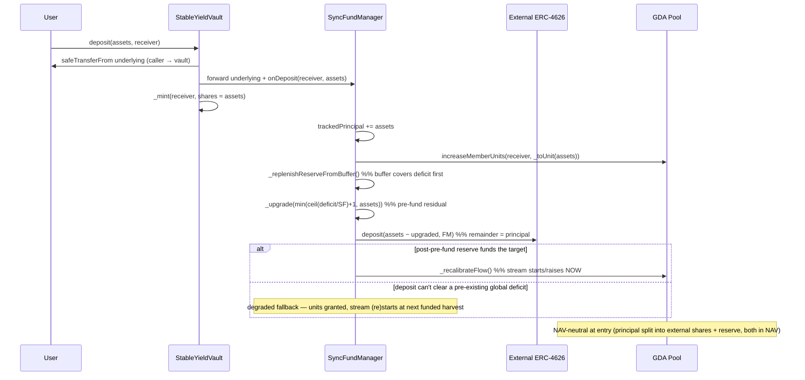

# Stable Yield Sync Vault — Design

Status: **locked** (brainstormed 2026-05-18; **revised 2026-05-19 — async-symmetric pivot**; open decisions resolved 2026-05-19, implementation in progress)

A synchronous ERC-4626 sibling of `StableYieldAsyncVault`. Users deposit/withdraw
instantly; principal is routed into an external ERC-4626 (Morpho, Beefy, …); a
**stable** yield is streamed to depositors via the same Superfluid GDA engine the
async vault uses. The external vault replaces the async vault's manual off-chain
"working assets" leg.

---

## ⚠️ Revision 2026-05-19 — async-symmetric refactor (supersedes the original locked model)

The original sync model (the table/invariants frozen on 2026-05-18) made the
**vault** the principal custodian, kept the share a hard 1:1 principal receipt,
and funded the stream *only* from harvested external surplus (never from
principal). Three asymmetries with the async family drove this revision; all
three are now resolved by converging the sync economic model onto the async one:

| # | Original sync behaviour | Revised behaviour (this document) |
|---|---|---|
| A | Vault holds the external-vault shares; vault does the external deposit/withdraw; vault owns `trackedPrincipal`, `totalAssets`, harvest surplus extraction. | **The FundManager is the sole capital custodian and NAV authority.** It holds the external-vault shares *and* the super-token reserve, owns `trackedPrincipal`, and computes NAV. The vault is a thin ERC-4626 share/accounting face that proxies `totalAssets`/`max*` to FM views — exactly the async split. |
| B | `harvest()` split across vault (surplus extraction) and FM (`harvestRebalance`). | **`harvest()` is a single permissionless `FundManager` entrypoint** with no vault involvement (enabled by A) — the direct analog of the async FM-entry `settleEpoch`. |
| C | Stream funded only from harvested external surplus; never draws principal. A fresh deposit grants units but the stream only *starts* once the reserve is independently funded (the first deposit could not stream at all until a later funded harvest / operator top-up). | **The stream is pre-funded from each deposit**, async-style: on deposit the FM first replenishes the reserve from the external buffer, then upgrades a slice of the incoming underlying to cover any residual `guaranteedFlowDuration` deficit, deposits the remainder into the external vault, and recalibrates — so the stream starts at deposit time, including the very first deposit. `totalAssets` now **includes the reserve**, so the deposit is NAV-neutral at entry and the share stays ≈1:1 while external yield ≥ the promised rate (honest pass-through otherwise). |
| D | n/a | **Forward solvency is maintained on every op, not only via the keeper `harvest()`.** A best-effort, deficit-gated `_replenishReserveFromBuffer()` runs at the start of every deposit and withdraw (no external calls when already solvent — the common case; capped at `EXTERNAL_VAULT.maxWithdraw(FM)` so it can never brick a user op). On redeem the reserve slice is funded by the **recalibration-freed reserve excess** (decreasing the redeemer's units lowers the required reserve), not by an NAV-pro-rata downgrade. |

Open decisions resolved 2026-05-19: reserve-inclusive NAV uses the **raw**
super-token balance (matches async; the donation surface is accepted, see
§Security); redeem is **async-faithful** via the recalibration-freed-excess
mechanism (decision 5). Decisions **1, 2, 4, 5** are revised; **6, 8, 10** are
refined; a new custody decision **11** is added; **3, 7, 9** are unchanged.

---

## Core principle

> **Principal is tracked by shares and custodied by the FundManager (deployed
> into the external ERC-4626). A stable yield is delivered out-of-band as a
> Superfluid stream, pre-funded from each deposit into the FM's super-token
> reserve and replenished by harvesting the external vault's surplus.**

NAV is the FM's recoverable external principal **plus** the super-token reserve,
so a deposit only changes the *form* of the FM's assets (external-vault shares ↔
super-token), never their total — the share is NAV-neutral at entry and stays
≈1:1 with the underlying while the external vault earns at least the promised
rate. This is structurally identical to the async vault (FM custodies capital +
a super-token reserve; NAV = working + unutilized + scaled reserve; the stream
distributes the reserve and is replenished by yield) **minus the epoch
lifecycle**. The streamed APY is operator-committed and decoupled from the
external vault's real performance; the surplus above it compounds inside the
external vault as a protocol-owned solvency **buffer**.

Consequences:

- The share is a principal receipt, **≈**1:1 with the underlying — *not* a hard
  peg. Between harvests the stream continuously drains the reserve, so NAV (and
  the share price) ticks slightly below par and recovers at the next funded
  harvest, exactly like the async forward-priced share but continuously
  observable instead of epoch-snapshotted.
- External yield above the promised rate is **not** booked into the share price
  — it stays inside the external vault as compounding external-vault shares, the
  protocol-owned **buffer**.
- That buffer is the loss-absorption layer: external losses shrink the buffer
  first; once a loss exceeds the entire accumulated buffer the residual passes
  through honestly via the `min(trackedPrincipal, external)` floor in NAV.
- The buffer is a **pure solvency reserve** — never extracted as treasury
  revenue. Treasury earns only the pre-existing 1% fee stream.
- Principal *transiently* funds the stream (the pre-fund slice) and is preserved
  long-run **iff** external yield ≥ the promised rate; otherwise the reserve
  depletes faster than the buffer replenishes it and the loss passes through
  honestly. This is the async risk profile (operator must keep the rate
  sustainable; no on-chain rate cap or settlement gate).

## Locked decisions

| # | Decision | Choice | Status |
|---|---|---|---|
| 1 | Share / loss model | Principal receipt **≈1:1** (reserve-inclusive NAV, ticks below par between harvests); honest loss pass-through via the `min(trackedPrincipal, external)` floor | **revised** |
| 2 | Surplus handling | External surplus (buffer) compounds inside the external vault; `harvest()` pulls only the reserve *deficit* out of it | refined |
| 3 | Rate model | Operator-set promised `stableYieldRate` (reuse async model) | unchanged |
| 4 | Stream funding | **Pre-funded from each deposit** into the super-token reserve (async-style), replenished by harvesting external surplus; principal preserved iff external yield ≥ rate | **revised** |
| 5 | Withdraw liquidity | Async-faithful: decreasing the redeemer's units lowers the required reserve; the **recalibration-freed excess** (capped at `min(freedExcess, redeemingAssets)`) funds the reserve slice (preserves stayers' horizon by construction), the remainder is drawn from the external vault (reverts only if the external vault is illiquid). Reserve is redeemable | **revised** |
| 6 | `harvest()` | Permissionless **and** a single FM entrypoint (no vault leg) | refined |
| 7 | Code reuse | Extract shared `FundManagerBase` | unchanged |
| 8 | Solvency trust model | Same as async (operator + views; no rate cap / settle gate). Stream starts at deposit via pre-funding; stall/recover is the **degraded fallback** only | refined |
| 9 | Async re-audit | Accepted as part of the base extraction | unchanged |
| 10 | First-deposit inflation | OZ ERC-4626 default mitigation; **re-examine** — reserve-inclusive NAV adds a super-token donation surface (see §Security) | refined |
| 11 | Capital custody | The FundManager is the sole custodian (external-vault shares + super-token reserve + transient unutilized underlying) and the sole NAV authority; the vault holds no assets | **new** |

## Contracts

### `FundManagerBase` (abstract — extracted from `AsyncFundManager`)

Unchanged by this revision — the shared Superfluid streaming engine. See
`docs/async-vault/shared-engine-refactor.md`. Members listed below stay exactly
as extracted: constants, immutables, `stableYieldRate`/`_flowRatePerUnit`/
`guaranteedFlowDuration`, constructor, `setStableYieldRate`,
`setGuaranteedFlowDuration`, `ensureYieldFlowDuration`,
`evaluateYieldAssetsDeficit`, `unutilizedAssetsBalance`, `yieldAssetsBalance`,
`scaledYieldAssetsBalance`, `_upgrade`, `_downgrade`, `_recalibrateFlow`,
`_rebalanceYieldAssets`, `_targetFlowRate`, `_toUnit`, `onShareTransfer`.

### `SyncFundManager` (extends `FundManagerBase`) — now the capital custodian

Holds the immutable `EXTERNAL_VAULT` reference, the `trackedPrincipal` counter,
the external-vault shares, and the super-token reserve. `_externalVault` is
passed in by the vault constructor, which already validated
`EXTERNAL_VAULT.asset() == UNDERLYING_ASSET` (no re-validation in the FM).

- `_replenishReserveFromBuffer()` (internal, best-effort, **deficit-gated**) —
  the shared per-op + harvest replenish step. `deficit = evaluateYieldAssetsDeficit()`;
  if `deficit <= 0` **return immediately (no external calls)** — the healthy and
  always-after-withdraw common case. Else pull
  `min(ceil(deficit / SCALING_FACTOR) + 1, EXTERNAL_VAULT.maxWithdraw(this) −
  trackedPrincipal)` (the buffer) out of the external vault and `_upgrade` it
  into the reserve. The pull is capped at `maxWithdraw(this)`, so a compliant
  (trusted) external vault never reverts it → it can **never brick** the calling
  user op (preserves decision 8 / never-brick).
- `onDeposit(receiver, assets)` — `VAULT_ROLE`. Receives `assets` underlying
  from the vault. `trackedPrincipal` is **not** bumped until *after* the buffer
  replenish — so the replenish reads the correct (pre-deposit) external buffer:
  1. `YIELD_POOL.increaseMemberUnits(receiver, _toUnit(assets))` — units land
     directly on the receiver (no FM-interim holding); `evaluateYieldAssetsDeficit()`
     now reflects the new (higher) target;
  2. `_replenishReserveFromBuffer()` — **buffer-first**, against the OLD
     `trackedPrincipal`: the compounding buffer covers the deficit first and
     principal is skimmed only as a fallback;
  3. `trackedPrincipal += assets`;
  4. **pre-fund residual**: `deficit = evaluateYieldAssetsDeficit()`;
     `toUpgrade = min(ceil(deficit / SCALING_FACTOR) + 1, assets)` (0 if the
     buffer already cleared it); `_upgrade(toUpgrade)`;
  5. `EXTERNAL_VAULT.deposit(assets − toUpgrade, address(this))` — the remainder
     is deployed as principal; **no underlying is left at rest in the FM**
     (custody hazard invariant — see Invariant 7);
  6. `_recalibrateFlow()` if the post-pre-fund reserve funds the target
     (`evaluateYieldAssetsDeficit() <= 0`); the stream starts/raises at deposit
     time. Otherwise skip — the deposit + buffer together could not clear a
     pre-existing global deficit (pathological rate×duration, or a vault already
     broken by external underperformance); units are still granted and the
     stream (re)starts at the next funded `harvest()` (the **degraded
     fallback**, decision 8).
- `onWithdraw(holder, shares, totalSharesOwned, supplyBeforeBurn, receiver,
  redeemingAssets)` — `VAULT_ROLE`. The async-`settleEpoch`-netting analog. The
  guarded recalibrate runs *before* the freed-excess computation, so the GDA
  "deposit buffer" slice attributable to the removed units is released back
  into the FM and becomes part of the redeemer's payout:
  1. `_replenishReserveFromBuffer()` — best-effort; opportunistically cures a
     *pre-existing* deficit (no-op when solvent, the common pre-withdraw case);
  2. proportional unit decrease (same math as async `onRequestRedeem`). Total
     units are now lower;
  3. **guarded `_recalibrateFlow()` *before* the freed-excess step**
     (`if getTotalFlowRate() != 0 || evaluateYieldAssetsDeficit() <= 0`) — the
     new lower flow rate refunds the GDA buffer slice for the removed units
     back into `YIELD_ASSET.balanceOf(FM)`. A stalled + still-under-funded
     vault is left stalled (the next funded harvest restarts it) so the
     withdrawal is never bricked;
  4. `deficit = evaluateYieldAssetsDeficit()` (post-recalibrate);
     `excessUnderlying = (deficit < 0) ? uint(−deficit) / SCALING_FACTOR : 0`;
     `fromReserve = min(excessUnderlying, redeemingAssets)`;
     `if (fromReserve > 0) _downgrade(fromReserve · SCALING_FACTOR)`. Because
     `fromReserve ≤` the recalibration-freed excess, the post-withdraw reserve
     still covers the reduced unit count's horizon — **stayers' stream is
     preserved by construction** (no stall in the healthy case);
  5. `fromExternal = redeemingAssets − fromReserve`;
     `if (fromExternal > 0) EXTERNAL_VAULT.withdraw(fromExternal, receiver, this)`
     (reverts only if the external vault is illiquid — accepted, decision 5);
     then `safeTransfer(receiver, fromReserve)` so the receiver gets exactly
     `redeemingAssets` and the FM holds 0 underlying;
  6. `trackedPrincipal -= trackedPrincipal · shares / supplyBeforeBurn` (floor,
     favours remaining holders — Invariant 1).
- `harvest()` — **permissionless**, `nonReentrant`, no vault leg.
  `deficit = evaluateYieldAssetsDeficit()`; `_replenishReserveFromBuffer()` (the
  `deficit > 0` path). If `deficit < 0`: **periodic-only trim** — `_downgrade`
  the excess super-token and **redeposit it into the external vault** so the
  buffer keeps compounding externally (the trim is *never* in the per-op hooks,
  to avoid churn). Restart a stalled stream iff units are outstanding and the
  post-rebalance reserve funds the target. `trackedPrincipal` is never
  read-from/written-to by harvest — only the buffer moves, so the share price
  does not jump on a harvest beyond the reserve top-up that is already in NAV.
- `fundReserve(amount)` — `FUND_OPERATOR_ROLE`. Operator injection retained for
  the async-parity trust model (top up the reserve on persistent external
  underperformance). Injected underlying is upgraded into the reserve by the
  next `harvest()` / `ensureYieldFlowDuration()`.
- View helpers the vault proxies (pure reads, no per-call counters):
  `totalManagedAssets()` (the reserve-inclusive NAV — Invariant 2),
  `serviceableUnderlying()` (returns `totalManagedAssets()` — per-call freed
  reserve excess scales with the redeemer's unit share, so NAV itself is the
  global upper bound on what a redeem can source; under impairment the clamp
  shrinks it appropriately), `maxExternalDeposit()`, plus
  `EXTERNAL_VAULT`/`trackedPrincipal` getters.

### `StableYieldVault` (extends OZ `ERC4626`, `ReentrancyGuard`) — thin face

Holds **no assets**. Immutable `FUND_MANAGER`; the constructor validates
`IERC4626(_externalVault).asset() == asset()` (keeps `EXTERNAL_ASSET_MISMATCH`
on `IStableYieldVault`) then deploys & pins `SyncFundManager` (`msg.sender ==
vault`), passing `_externalVault` through. `EXTERNAL_VAULT()` / `trackedPrincipal()`
getters delegate to the FM (ABI/back-compat).

- `totalAssets()` → `FUND_MANAGER.totalManagedAssets()`
  `= min(trackedPrincipal, EXTERNAL_VAULT.maxWithdraw(FM) +
  scaledYieldAssetsBalance()) + unutilizedAssetsBalance()`. The `min(…)` clamp
  on recoverable-from-all-sources (external + reserve) is the on-chain honest
  analog of async's NAV — it gives honest loss pass-through *and* naturally
  excludes the compounding external buffer + super-token donations above
  `trackedPrincipal` from share price.
- `_deposit(caller, receiver, assets, shares)`: pull underlying from `caller`,
  forward it to the FM, `_mint(receiver, shares)`, `FUND_MANAGER.onDeposit(...)`.
  `nonReentrant`.
- `_withdraw(caller, receiver, owner, assets, shares)`: spend allowance, read
  `balanceOf(owner)` + `totalSupply()` **before** the burn, `_burn(owner, shares)`,
  `FUND_MANAGER.onWithdraw(owner, shares, totalSharesOwnedBefore,
  supplyBeforeBurn, receiver, assets)` (FM moves principal + reserve + units;
  CEI: vault state mutated before the FM's external interaction, `nonReentrant`
  backstop). `nonReentrant`.
- `harvest()` — optional thin `FUND_MANAGER.harvest()` forwarder for ERC-4626
  ergonomics (the canonical entrypoint is on the FM).
- `maxDeposit/maxMint` capped by `FUND_MANAGER.maxExternalDeposit()` (the
  external vault's deposit limit, FM as holder). `maxWithdraw/maxRedeem` capped
  by `FUND_MANAGER.serviceableUnderlying()` (= `totalManagedAssets()` — the
  reserve-inclusive NAV is the global upper bound on what a redeem can source,
  since the recalibration-freed reserve excess scales with the redeemer's unit
  share). Under external impairment the NAV clamp shrinks this appropriately,
  making `max*` 4626-honest about external illiquidity.
- `_update` → `FUND_MANAGER.onShareTransfer(from, to, value)` on
  shareholder↔shareholder transfers (unchanged rule).
- `previewDeposit/Mint/Redeem/Withdraw` work synchronously (OZ default — no
  revert, unlike the async vault).

## Flows

### Deposit (stream starts at deposit time)



### Withdraw / Redeem (reserve-inclusive NAV; reserve slice from recalibration-freed excess)

```mermaid
sequenceDiagram
    participant U as User
    participant V as StableYieldVault
    participant FM as SyncFundManager
    participant E as External ERC-4626
    U->>V: withdraw(assets, receiver, owner)  %% assets = previewRedeem-priced NAV slice
    V->>V: spendAllowance? ; read balance/supply ; _burn(owner, shares)
    V->>FM: onWithdraw(owner, shares, totalOwnedBefore, supplyBeforeBurn, receiver, assets)
    FM->>FM: _replenishReserveFromBuffer()  %% no-op when solvent (common case)
    FM->>FM: proportional unit decrease  %% required reserve now lower
    FM->>FM: fromReserve = min(freed excess, assets) ; _downgrade(fromReserve·SF)
    FM->>E: withdraw(assets − fromReserve, receiver, FM)  %% external remainder
    FM->>FM: safeTransfer(receiver, fromReserve) ; trackedPrincipal -= principal slice
    FM->>FM: guarded _recalibrateFlow()  %% lower target — trivially safe
    Note over E: external remainder reverts only if the external vault is illiquid (accepted)
```

Under impairment (`EXTERNAL_VAULT.maxWithdraw(FM) < trackedPrincipal`): the NAV
floor falls, `previewRedeem` prices the share below par, the redeemer takes the
pro-rata impaired payout. The proportional `trackedPrincipal` decrement
(Invariant 1) keeps `V/P` constant across the exit, so no value transfers
between leavers and stayers.

### Harvest (permissionless, FM entrypoint)

```mermaid
sequenceDiagram
    participant K as Anyone
    participant FM as SyncFundManager
    participant E as External ERC-4626
    K->>FM: harvest()   %% nonReentrant, no auth, no vault leg
    FM->>FM: deficit = evaluateYieldAssetsDeficit()
    alt deficit > 0
        FM->>E: surplus = maxWithdraw(FM) − trackedPrincipal
        FM->>E: withdraw(min(ceil(deficit/SF)+1, surplus), FM, FM)
        FM->>FM: upgrade pulled underlying → reserve ; restart stalled flow
    else deficit < 0
        FM->>FM: downgrade excess ; redeposit into external vault (buffer compounds)
    end
    Note over E: surplus beyond the deficit stays compounding as the buffer
```

`harvest()` only ever pulls the reserve **deficit** out of the buffer, never the
full surplus — that is what makes the buffer compound and absorb losses.

## Invariants

1. **Principal accounting (FM-owned).** `trackedPrincipal += assets` on deposit;
   `trackedPrincipal −= trackedPrincipal · sharesBurned / totalSupplyBeforeBurn`
   (floor) on withdraw. Proportional, not by payout — keeps `V/P` invariant
   through impaired exits.
2. **Total assets (reserve-inclusive, clamped to principal).** `totalAssets ==
   min(trackedPrincipal, EXTERNAL_VAULT.maxWithdraw(FM) +
   scaledYieldAssetsBalance()) + unutilizedAssetsBalance()`. *Recoverable from
   all sources* = external position + super-token reserve, clamped at
   `trackedPrincipal` so the compounding external buffer (and any super-token
   donation pushing recoverable above principal) are excluded from share price.
   Under impairment the clamp goes the other way (clamped at the lower
   recoverable) and the share takes the loss honestly.
3. **Buffer non-negative & non-extracted.** While solvent,
   `EXTERNAL_VAULT.maxWithdraw(FM) ≥ trackedPrincipal`; the surplus is only ever
   moved to top the reserve up to its deficit (`harvest()`), never to the
   treasury.
4. **Stream pre-funded from deposits.** Every deposit first replenishes the
   reserve from the buffer (`_replenishReserveFromBuffer()`), then upgrades
   enough of the *incoming* underlying to clear any residual
   `guaranteedFlowDuration` deficit (capped by the deposited amount). The stream
   draws on principal *only transiently and only when the buffer is
   insufficient* — principal is preserved long-run iff external yield ≥ the
   promised rate (else honest pass-through).
5. **Reserve horizon.** Replenished on every deposit/withdraw (best-effort,
   deficit-gated) and by `harvest()`:
   `yieldAssetsBalance() ≥ totalFlowRate · guaranteedFlowDuration`
   (best-effort; same trust model as async — nothing structurally enforces it).
   A withdraw cannot break it for stayers: units drop → required reserve drops,
   and only the recalibration-*freed* excess is ever downgraded for the redeemer
   (`fromReserve ≤ freedExcess`), so the post-withdraw reserve still covers the
   reduced unit count by construction. Degraded fallback: if a deposit + buffer
   together cannot clear a pre-existing global deficit the stream is left
   stalled and (re)started by the next funded harvest; deposits/withdrawals are
   never bricked.
6. **Units track shareholding.** A holder's GDA units are proportional to their
   share balance; transfers move a proportional slice (`onShareTransfer`).
7. **FM is the sole custodian.** All vault-controlled assets (external-vault
   shares, super-token reserve, transient unutilized underlying) live in the FM;
   the vault's underlying/super-token balances are 0 at rest. **Custody hazard
   invariant:** principal never rests in the FM as raw underlying across calls —
   it is deployed into the external vault or upgraded into the reserve within
   the same call, otherwise the base rebalance logic would sweep it into the
   reserve and silently consume principal.

## Security considerations

- **Reserve-inclusive NAV is donation-resistant by the min-clamp (locked
  2026-05-19; refined).** The decision was to use the raw super-token balance
  (matching async). The corrected NAV formula `min(trackedPrincipal, ext +
  reserve) + unutilized` (Invariant 2) additionally **clamps the recoverable at
  `trackedPrincipal`**, so a super-token donation pushing `ext + reserve` above
  `trackedPrincipal` leaves NAV unchanged in the healthy/solvent state — the
  donation is absorbed by the clamp, not the share price. The residual surface
  is only `unutilizedAssetsBalance()` (operator/external transfers of underlying
  to the FM), which is bounded by OZ virtual shares as defense-in-depth and is
  characterised by a Phase-4 test. Audit should confirm the clamp behavior
  under impairment and the residual unutilized-donation magnitude.
- **Share price ticks between harvests.** The stream continuously drains the
  reserve, so NAV (and thus `convertToShares/Assets`, deposit/withdraw/transfer
  pricing) decays between harvests and recovers at each funded harvest. This is
  the async forward-priced property made continuously observable. Timing/MEV
  around harvest cadence is a known consideration; mitigations: frequent
  permissionless harvest, OZ virtual shares, rounding favours the vault,
  `nonReentrant`.
- **Pre-funding can exceed the deposit (pathological config).** If
  `rate × guaranteedFlowDuration / YEAR` approaches 1, a deposit's own
  incremental reserve requirement can approach/exceed `assets`. The pre-fund is
  capped by `assets`; the shortfall degrades to the stall/recover fallback. The
  operator must keep `stableYieldRate × guaranteedFlowDuration` sane (no
  on-chain cap — same trust model as async).
- **A new deposit can subsidise a pre-existing reserve backlog.** The pre-fund
  clears the *global* `evaluateYieldAssetsDeficit()` (the GDA buffer requirement
  is global — a stream cannot be partially started). The buffer-first
  `_replenishReserveFromBuffer()` substantially mitigates this — the compounding
  buffer covers the backlog before any of the new deposit is skimmed — but in a
  vault whose buffer is exhausted (external persistently underperformed) a fresh
  deposit's funds can still partly back existing holders' streams. Accepted
  under the async trust model (operator keeps the rate sustainable / buffer
  absorbs); flagged for audit and disclosure.
- **External vault is trusted but third-party.** `maxWithdraw(FM)` feeds NAV,
  the harvest surplus, and the withdraw principal leg — a manipulable external
  share price propagates in. Integrate only standard, audited, non-rebasing
  4626s whose `asset()` equals our underlying.
- **Reentrancy.** `nonReentrant` on `deposit`/`mint`/`withdraw`/`redeem` (vault)
  and `harvest` (FM); CEI ordering — vault burns/state-updates before the FM's
  external interaction; the FM's value-bearing `VAULT_ROLE` hooks are reachable
  only from the pinned vault and are backstopped by the vault guard.
- **FM hooks are now value-bearing.** `onDeposit`/`onWithdraw` move principal +
  reserve (not just GDA units as in the original model). The `VAULT_ROLE` gate
  and the custody hazard invariant (7) are load-bearing; audit must confirm no
  principal can be diverted via the rebalance path.
- **External illiquidity** (accepted, decision 5): the redeemer's reserve slice
  is funded from the recalibration-freed reserve excess (always serviceable via
  `_downgrade`); only the *external remainder* reverts if the external vault
  cannot service it. `maxWithdraw`/`maxRedeem` reflect it via
  `serviceableUnderlying() = totalManagedAssets()` — under external impairment
  the NAV clamp shrinks the bound, so a request ≤ `max*` never bricks.
- **Rate > sustainable yield** (accepted, same as async): the reserve/buffer
  depletes and the stream stalls; the operator must lower `stableYieldRate` or
  `fundReserve`. No on-chain cap or settlement gate.
- **Decimals.** Inherited `SCALING_FACTOR`/`RAW_PER_UNIT` constraints (underlying
  decimals ∈ [6, 18]; the existing 18-dec `FIXME` carries over). External-vault
  share decimals are independent and handled via its own `convert*`.

## Out of scope / explicitly dropped vs async

Epoch lifecycle in its entirety: `requestDeposit`/`requestRedeem`, snapshot,
`closeEpoch`/`settleEpoch`, effective-supply correction, `canSettleEpoch`,
`evaluateFunding`, ERC-7540/7575 interfaces, ERC-7540 operators, `take`/`give`
off-chain capital movement (the external ERC-4626 replaces the working-capital
leg). The async settlement *netting* logic is not dropped — it reappears
synchronously and per-call inside `SyncFundManager.onDeposit`/`onWithdraw`.
