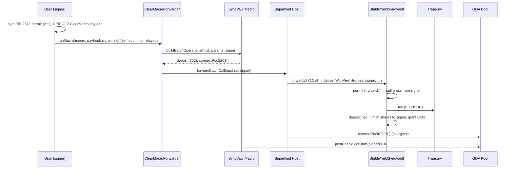

# Batched Deposit Flow (permit + deposit + connect-to-pool, 1 tx)

How a new depositor's onboarding — **EIP-2612 permit → deposit → connect to the GDA yield pool** —
is collapsed into a single user-signed transaction via a Superfluid macro. This is an *optional
periphery* path; the plain [deposit flow](./deposit-flow.md) is unchanged and remains the base case.
See [`../design.md`](../design.md) for the model; the batching contract is
`SyncVaultMacro` (`src/vault/sync/SyncVaultMacro.sol`).

## Contracts involved

| Contract | Role |
|---|---|
| **SyncVaultMacro** | `ClearMacroBase` macro pinned to one vault, exposing two actions (deposit-and-connect, redeem). Builds the ops; carries the EIP-712 clear-signing metadata. Custodies nothing |
| **ClearMacroForwarder** | Superfluid forwarder. Verifies the signer's EIP-712 payload, then calls `host.forwardBatchCall(ops)` as that signer |
| **Superfluid Host** | Runs the batch. For the deposit op it routes through its `ERC2771Forwarder`, appending the signer to the vault's calldata |
| **StableYieldSyncVault** | EIP-2771 recipient. Recovers the real depositor from the appended calldata, runs `depositWithPermit` (inline permit + fee-bearing deposit) |
| **GDA Pool** | The connect target — connecting makes the streamed yield auto-reflect in the depositor's super-token balance |

## Why a macro (and not a plain router)

`connectPool` connects `msg.sender`. To connect the *depositor*, the connect must execute **as** the
depositor — which only the Host batch (`forwardBatchCall`, run as the verified signer) provides. A
periphery router calling `connectPool` would connect *itself*. So the macro/Host path is required,
and — because the deposit leg reaches the vault as a type-302 call — the vault must be EIP-2771-aware.

## The 2-op batch

`SyncVaultMacro` builds exactly two operations (`account` = the verified signer):

| # | Op type | Target | Call |
|---|---|---|---|
| 0 | `ERC2771_FORWARD_CALL` (302) | vault | `depositWithPermit(gross, account, deadline, v, r, s)` |
| 1 | `SUPERFLUID_CALL_AGREEMENT` (201) | GDA | `connectPool(POOL)` |

- **Op0 `data` is raw calldata.** The Host's `ERC2771Forwarder.forward2771Call(vault, account, data)`
  appends `account`, so `msg.sender` at the vault is the forwarder and `_msgSender()` resolves to
  `account`. The vault pulls `gross` from / mints shares to `account`. The inline permit sets the
  allowance in the same call (front-run tolerant — see below).
- **Op1 `data` is ctx-wrapped** (`abi.encode(callData, emptyCtx)`); the Host fills the real ctx and
  runs it as `account`.
- **`gross` = net principal + the flat `DEPOSIT_FEE`** (0.2 USDC). The permit authorizes `gross`; the
  vault skims the fee to the treasury and deposits the net. Units/shares are granted on the **net**
  (see [deposit flow](./deposit-flow.md) and [C.1](../invariants.md)).
- Order matters only for the dependency (deposit before connect grants the units the connect surfaces)
  — there is **no `msg.value` routing concern**, because the fee is in-token, not native ETH.

## Sequence

## The redeem action (single op)

The same macro exposes a `Redeem` action — a meta-tx (gasless relay), not a batch. It builds exactly
one operation (`account` = the verified signer):

| # | Op type | Target | Call |
|---|---|---|---|
| 0 | `ERC2771_FORWARD_CALL` (302) | vault | `redeem(shares, account, account)` |

- **No permit, no allowance.** The forwarder appends `account`, so `_msgSender()` at the vault is the
  signer. In `_withdraw` `caller == owner == account`, so OZ's allowance branch is skipped and the
  vault burns the signer's *own* shares, paying the OZ pro-rata proceeds back to the signer.
- **No connect op.** The FM's `onWithdraw` decreases the holder's pool units (zeroing them on a full
  exit); any residual pool connection is harmless, so nothing needs disconnecting.
- **`deadline`** is bound into the clear-signed digest (bounding the signed intent's validity so a
  stale redeem can't execute later at a different NAV) but is consumed by no op.
- No `postCheck` (`_noOpPostCheck`): the redeem op reverts on failure, and there is no before-state
  snapshot against which to assert a delta.

## Submission modes

The on-chain effect is identical in both; they differ only in who broadcasts and pays gas:

- **Self-submit** (`Security.provider = "self"`): the user broadcasts and pays gas. No native value
  attached — the fee is in-token.
- **Provider-relay (gasless)**: the user only signs; a relay provider submits and recovers gas from
  the user's Super Token (USDCx) balance (separate from the deposit fee). Now viable precisely because
  the fee no longer needs native ETH.

## Security notes

- **EIP-2771 trust is benign.** The vault trusts only the Host's canonical `ERC2771Forwarder`, which
  only ever appends the Host-authenticated batch initiator — equivalent to the user calling directly.
  An untrusted caller appending a spoofed sender is ignored (`_msgSender()` stays `msg.sender`).
- **Permit front-run tolerance.** `depositWithPermit` wraps the permit in `try/catch`: a third party
  landing the same permit first (consuming the nonce, setting the allowance) does not brick the
  deposit — the pull proceeds off the standing allowance. The permit can never authorize a pull the
  token's own allowance check wouldn't already permit (`transferFrom` is the real gate).
- **Permit `v,r,s` are not in the clear-signed digest** (only `assets`/`deadline` + description are).
  A relayer tampering the signature can only make the permit fail (swallowed) → at worst a self-
  defeating DoS, never a redirected pull.

## Tests

- `test/vault/sync/SyncVaultEIP2771.t.sol` — vault EIP-2771 sender recovery, spoof rejection,
  `depositWithPermit` (happy / front-run / below-fee).
- `test/vault/sync/SyncVaultMacro.t.sol` — op-shape, clear-signing views, and full `host.batchCall`
  integrations for both actions (permit + deposit + connect end-to-end; and redeem end-to-end).
