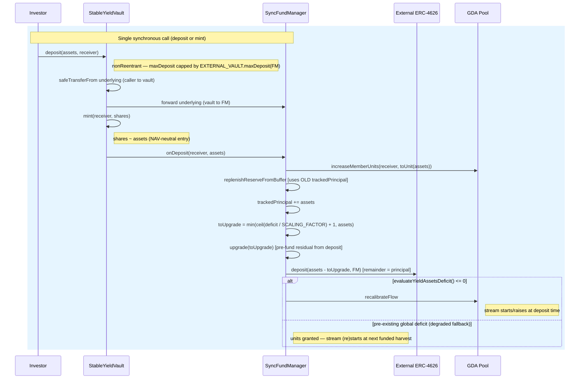

# Investor Deposit Flow (Synchronous)

> **Revised 2026-05-19 (async-symmetric pivot).** The FundManager is now the
> sole capital custodian; the stream is **pre-funded from each deposit** so it
> starts at deposit time (including the first deposit); `totalAssets` is
> reserve-inclusive so the deposit is NAV-neutral at entry. See
> `docs/sync-vault/design.md §Revision 2026-05-19`.

## Contracts involved

| Contract | Role |
|---|---|
| **StableYieldVault** | ERC-4626 share/accounting face. Pulls underlying from the caller, forwards it to the FM, mints principal-pegged shares. Holds **no** assets |
| **SyncFundManager** | Sole capital custodian. Owns `trackedPrincipal`, the external-vault shares and the super-token reserve. Bumps principal, pre-funds the reserve, deploys the remainder into the external vault, starts the stream |
| **External ERC-4626** | Third-party vault (Morpho/Beefy/…) that custodies the principal remainder and earns the real, compounding yield |
| **GDA Pool** | Superfluid pool owned by the FM. Streams the stable yield (super-token) to unit holders |
| **Fund Operator** | EOA/bot holding `FUND_OPERATOR_ROLE`. Manages the rate and may inject reserve (`fundReserve`) |

There is no waiting room, epoch, snapshot, or settlement. Deposit is a single
synchronous transaction.

## Asset states

| State | Location | Description |
|---|---|---|
| ASSETS | Investor wallet | Underlying tokens held by the investor |
| PRINCIPAL | External ERC-4626 (held by **FM**) | Deposited underlying minus the pre-fund slice, routed into the external vault. Tracked by `trackedPrincipal` (FM-owned) |
| YIELD-ASSET RESERVE | FundManager (super-token) | The pre-fund slice, upgraded to super-token, funding the GDA flow. Equals `yieldAssetsBalance()`. **Counted in NAV** (`scaledYieldAssetsBalance()`) |
| BUFFER | External ERC-4626 (held by **FM**) | Compounding external yield above the promised rate (`EXTERNAL_VAULT.maxWithdraw(FM) − trackedPrincipal`). Protocol-owned solvency reserve; excluded from share price |
| UNUTILIZED ASSETS | FundManager (underlying) | Transient only — must be 0 at rest (custody hazard invariant). Principal never lingers here across calls |

## Sequence diagram



## Flow

```
(1) Investor → Vault: deposit(assets, receiver)         [or mint(shares, receiver)]
    - nonReentrant
    - OZ ERC-4626 checks assets <= maxDeposit(receiver), where
      maxDeposit(receiver) == EXTERNAL_VAULT.maxDeposit(FM)
      (4626-honest about the external vault's own deposit cap, FM as holder)
    - shares = previewDeposit(assets) = _convertToShares(assets, Floor)
        = assets * (totalSupply + 1) / (totalAssets + 1)
      totalAssets is reserve-inclusive
      (= min(trackedPrincipal, ext.maxWithdraw(FM)) + unutilized + scaledReserve).
      A deposit raises external principal + reserve by exactly `assets`
      (principal only changes form), so NAV/supply is preserved and shares ≈
      `assets` — the share is a ≈1:1 principal receipt at entry.

(2) Vault._deposit(caller, receiver, assets, shares):
    - underlying.safeTransferFrom(caller → vault, assets)
    - forward `assets` underlying to the FM (the custodian)
    - _mint(receiver, shares)                       — `_update` skips the
      onShareTransfer hook for the mint leg (from == address(0))
    - FUND_MANAGER.onDeposit(receiver, assets)      (3)
    - emit Deposit(caller, receiver, assets, shares)

(3) FundManager.onDeposit(receiver, assets)  (onlyRole VAULT_ROLE):
    a. units = _toUnit(assets) = assets / RAW_PER_UNIT
       (RAW_PER_UNIT = 10 ** (underlyingDecimals − 6); one whole token == 1e6
        units). A sub-RAW_PER_UNIT dust deposit maps to 0 units and is skipped.
       POOL.increaseMemberUnits(receiver, units)    — units land directly on
       the receiver (no FM-interim holding, unlike async claim-time transfer).
       evaluateYieldAssetsDeficit() now reflects the new (higher) target.
    b. REPLENISH FROM BUFFER (best-effort, deficit-gated):
       _replenishReserveFromBuffer()
       — runs against the OLD trackedPrincipal (buffer surplus = ext.maxWithdraw
         − trackedPrincipal_pre); the compounding external buffer covers the
         deficit first; principal is skimmed only as a fallback. No external
         calls when already solvent. Capped at EXTERNAL_VAULT.maxWithdraw(FM)
         so it can never brick the deposit.
    c. trackedPrincipal += assets                   (Invariant 1)
       — booked AFTER the replenish so the buffer calc is correct.
    d. PRE-FUND RESIDUAL from the deposit:
       deficit  = evaluateYieldAssetsDeficit()      (residual after the buffer
                  replenish; reflects the new, higher total units)
       toUpgrade = min(uint(deficit) / SCALING_FACTOR + 1, assets)   if deficit>0
                   else 0  (0 when the buffer already cleared it)
       _upgrade(toUpgrade)                           — underlying → super-token
         reserve covering guaranteedFlowDuration of the new units' flow + the
         1% fee leg
    e. EXTERNAL_VAULT.deposit(assets − toUpgrade, FM)
       — the remainder is deployed as principal. NOTHING is left at rest in the
         FM as raw underlying (custody hazard invariant, Inv. 7).
    f. if evaluateYieldAssetsDeficit() <= 0:
         _recalibrateFlow()
           flowRate = _flowRatePerUnit * POOL.totalUnits   (yield + 1% fee pool)
         → the stream starts/raises at deposit time, including the first deposit
       else:
         skip — the deposit + buffer together could not clear a pre-existing
         global deficit (pathological rate×guaranteedFlowDuration, or a vault
         already broken by external underperformance). Units are still granted;
         the stream (re)starts at the next funded `harvest()`. This is the
         DEGRADED FALLBACK only (design decision 8 / Invariant 5), not the
         normal path.
```

## Why the stream starts now (and is NAV-neutral)

- `_toUnit(assets)` units are granted to the receiver, then the reserve is
  upgraded to cover the **global** GDA buffer requirement (a Superfluid stream
  cannot be partially started — `distributeFlow` needs the whole reserve to
  back the whole flow). For any sane `rate × guaranteedFlowDuration` and a
  not-already-broken vault, a single deposit clears that requirement, so
  `_recalibrateFlow()` succeeds and the stream is live from this block.
- The deposit only changes the *form* of the FM's assets: `assets` of
  underlying becomes `(assets − toUpgrade)` external principal + `toUpgrade`
  super-token reserve, **both counted in NAV**. So `totalAssets` rises by
  exactly `assets`, the share price is unchanged, and the depositor is not
  diluted by funding their own stream — the pre-fund is returned to them
  out-of-band as the stream while the buffer replenishes the reserve.

## ERC-4626 compliance

- `deposit` / `mint` are synchronous and pull underlying from the caller.
- `previewDeposit` / `previewMint` work synchronously (OZ defaults — they do
  **not** revert, unlike the async ERC-7540 sibling).
- `maxDeposit` / `maxMint` are additionally capped by the external vault's own
  deposit limit (with the FM as holder).
- Shares are transferable ERC-20. The vault's `_update` hook calls
  `FundManager.onShareTransfer(from, to, value)` on shareholder-to-shareholder
  transfers (skipping mint/burn legs); FM moves a proportional slice of GDA
  pool units so the yield stream follows the shares.

## Key invariants

1. **Principal accounting (FM-owned).** `trackedPrincipal += assets` on every
   deposit.
2. **NAV-neutral entry.** `assets` of underlying splits into external principal
   + super-token reserve, both in NAV; share price unchanged; shares ≈ `assets`.
3. **No idle underlying.** Every deposited asset is either upgraded into the
   reserve or routed into the external vault in the same call; the FM holds 0
   underlying at rest (custody hazard invariant).
4. **Stream starts at deposit time** (pre-funded) on the normal path; the
   stall/recover model is the degraded fallback only (a single deposit cannot
   clear a pre-existing global reserve deficit).
5. **Units track shareholding.** A holder's GDA units are proportional to their
   share balance.
