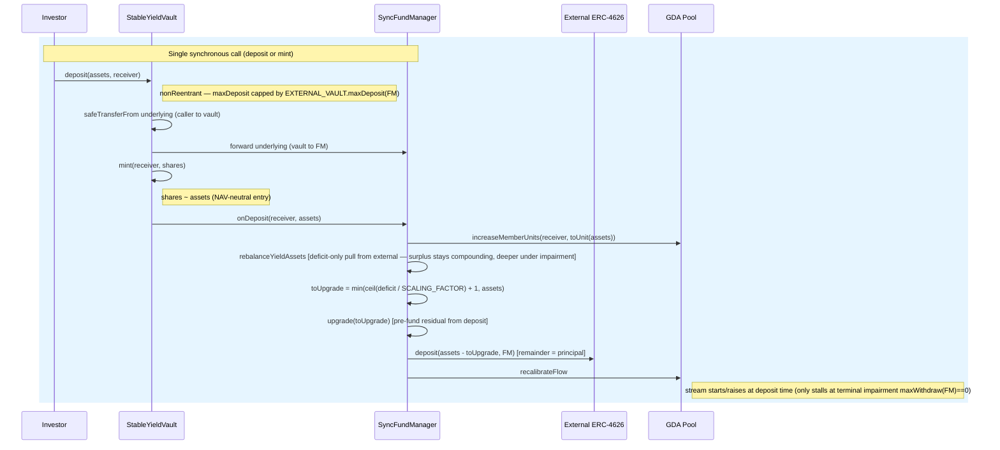

# Investor Deposit Flow (Synchronous)

> **Revised 2026-05-19 (async-symmetric pivot); revised 2026-05-26 (NAV clamp
> dropped — floating share).** The FundManager is the sole capital custodian;
> the stream is **pre-funded from each deposit** so it starts at deposit time
> (including the first deposit); `totalAssets` is the reserve-inclusive **plain
> sum** of recoverable balances (no clamp), so the deposit is NAV-neutral at
> entry and the share floats with the external vault thereafter. See
> `docs/sync-vault/design.md §Revision 2026-05-26`.

## Contracts involved

| Contract | Role |
|---|---|
| **StableYieldVault** | ERC-4626 share/accounting face. Pulls underlying from the caller, forwards it to the FM, mints (floating) shares. Holds **no** assets |
| **SyncFundManager** | Sole capital custodian. Owns the external-vault shares and the super-token reserve (no `trackedPrincipal` counter). Pre-funds the reserve, deploys the remainder into the external vault, starts the stream |
| **External ERC-4626** | Third-party vault (Morpho/Beefy/…) that custodies the principal remainder and earns the real, compounding yield |
| **GDA Pool** | Superfluid pool owned by the FM. Streams the stable yield (super-token) to unit holders |
| **Fund Operator** | EOA/bot holding `FUND_OPERATOR_ROLE`. Sets `stableYieldRate` and `guaranteedFlowDuration` (the only sustainability levers — no on-chain reserve injection path) |

There is no waiting room, epoch, snapshot, or settlement. Deposit is a single
synchronous transaction.

## Asset states

| State | Location | Description |
|---|---|---|
| ASSETS | Investor wallet | Underlying tokens held by the investor |
| PRINCIPAL | External ERC-4626 (held by **FM**) | Deposited underlying minus the pre-fund slice, routed into the external vault. Counted in NAV via `EXTERNAL_VAULT.maxWithdraw(FM)` |
| YIELD-ASSET RESERVE | FundManager (super-token) | The pre-fund slice, upgraded to super-token, funding the GDA flow. Equals `yieldAssetsBalance()`. **Counted in NAV** (`scaledYieldAssetsBalance()`) |
| EXTERNAL SURPLUS | External ERC-4626 (held by **FM**) | Compounding external yield above the promised rate. **Counted in NAV** (part of `maxWithdraw(FM)`) — accrues to shareholders as share appreciation; not a protocol-owned excluded slice |
| UNUTILIZED ASSETS | FundManager (underlying) | Transient only — must be 0 at rest (custody hazard invariant). Principal never lingers here across calls |

## Sequence diagram



## Flow

```
(1) Investor → Vault: deposit(assets, receiver)         [or mint(shares, receiver)]
    - nonReentrant
    - OZ ERC-4626 checks assets <= maxDeposit(receiver), where
      maxDeposit(receiver) == EXTERNAL_VAULT.maxDeposit(FM)
      (4626-honest about the external vault's own deposit cap, FM as holder)
    - shares = previewDeposit(assets) = _convertToShares(assets, Floor)
        = assets * (totalSupply + 10**offset) / (totalAssets + 1)
      totalAssets is the reserve-inclusive plain sum
      (= EXTERNAL_VAULT.maxWithdraw(FM) + scaledReserve + rawUnderlying; no clamp).
      A deposit raises external principal + reserve by exactly `assets`
      (principal only changes form), so NAV/supply is preserved and shares ≈
      `assets` at entry — the share is NAV-neutral on the way in, then floats.

(2) Vault._deposit(caller, receiver, assets, shares):
    - underlying.safeTransferFrom(caller → vault, assets)
    - forward `assets` underlying to the FM (the custodian)
    - _mint(receiver, shares)                       — `_update` skips the
      onShareTransfer hook for the mint leg (from == address(0))
    - FUND_MANAGER.onDeposit(receiver, assets)      (3)
    - emit Deposit(caller, receiver, assets, shares)

(3) FundManager.onDeposit(receiver, assets)  (onlyRole VAULT_ROLE):
    a. units = _toUnit(assets) = assets / RAW_PER_UNIT
       (RAW_PER_UNIT = 10 ** (underlyingDecimals − 6); one whole token == 1e6
        units). A sub-RAW_PER_UNIT dust deposit maps to 0 units and is skipped.
       POOL.increaseMemberUnits(receiver, units)    — units land directly on
       the receiver (no FM-interim holding, unlike async claim-time transfer).
       evaluateYieldAssetsDeficit() now reflects the new (higher) target.
    b. REBALANCE RESERVE FROM EXTERNAL POSITION (best-effort, deficit-gated):
       _rebalanceYieldAssets()
       — pulls min(deficit, EXTERNAL_VAULT.maxWithdraw(FM)) and upgrades it,
         i.e. only the reserve *deficit* (the external surplus stays deployed
         and compounding — it is in NAV and accrues to holders). While external
         yield ≥ rate the pull is funded by that surplus; under impairment the
         same deficit-only pull continues deeper into the external position —
         the loss surfaces directly in the (unclamped) NAV, not as a stalled
         stream. No external calls when already solvent. Capped at
         EXTERNAL_VAULT.maxWithdraw(FM) so it can never brick the deposit.
    c. PRE-FUND RESIDUAL from the deposit:
       deficit  = evaluateYieldAssetsDeficit()      (residual after the
                  rebalance; reflects the new, higher total units)
       toUpgrade = min(uint(deficit) / SCALING_FACTOR + 1, assets)   if deficit>0
                   else 0  (0 when the rebalance already cleared it)
       _upgrade(toUpgrade)                           — underlying → super-token
         reserve covering guaranteedFlowDuration of the new units' flow + the
         1% fee leg
    d. EXTERNAL_VAULT.deposit(assets − toUpgrade, FM)
       — the remainder is deployed as principal. NOTHING is left at rest in the
         FM as raw underlying (custody hazard invariant, Inv. 7).
    e. _recalibrateFlow()  (unconditional — there is no in-hook guard)
         flowRate = _flowRatePerUnit * POOL.totalUnits   (yield + 1% fee pool)
       → the stream starts/raises at deposit time, including the first deposit.
       The uncapped rebalance in step b together with the residual pre-fund in
       step c clears any pre-existing global deficit in every non-terminal
       regime. The only state where the post-step-d deficit can still be > 0
       is terminal impairment (EXTERNAL_VAULT.maxWithdraw(FM) == 0); the
       recalibrate is NOT guarded against that — instead the vault-level pause
       (`_isExternallyPaused()` → maxDeposit == 0) makes `onDeposit` unreachable
       while impaired, so the drained-reserve recalibrate is never met here. The
       next operator-called `ensureYieldFlowDuration()` restarts the stream once
       the external position unfreezes. (The earlier "guarded recalibrate" was
       never implemented and was dropped — see design.md §Revision 2026-05-27.)
```

## Why the stream starts now (and is NAV-neutral)

- `_toUnit(assets)` units are granted to the receiver, then the reserve is
  upgraded to cover the **global** GDA buffer requirement (a Superfluid stream
  cannot be partially started — `distributeFlow` needs the whole reserve to
  back the whole flow). The deficit-only rebalance pulls any pre-existing
  global deficit from the external position first (the surplus, then deeper
  into the position under impairment); the residual incoming-deposit pre-fund
  covers what the external position cannot. In every non-terminal regime the
  post-step deficit is ≤ 0 and `_recalibrateFlow()` brings the stream live in
  this block. The recalibrate is unconditional; terminal impairment is kept out
  of this hook by the vault-level pause (it makes `maxDeposit == 0`), not by a
  guard inside `_recalibrateFlow()`.
- The deposit only changes the *form* of the FM's assets: `assets` of
  underlying becomes `(assets − toUpgrade)` external principal + `toUpgrade`
  super-token reserve, **both counted in NAV**. So `totalAssets` rises by
  exactly `assets`, the share price is unchanged at entry, and the depositor is
  not diluted by funding their own stream — the pre-fund is returned to them
  out-of-band as the stream while the external position replenishes the
  reserve. After entry the share **floats**: it appreciates while external
  yield exceeds the promised rate and declines under impairment (the
  (unclamped) NAV falls), so a new depositor always enters at the current
  honest price — no value transfer between leavers/stayers beyond what the
  share price already reflects.

## ERC-4626 compliance

- `deposit` / `mint` are synchronous and pull underlying from the caller.
- `previewDeposit` / `previewMint` work synchronously (OZ defaults — they do
  **not** revert, unlike the async ERC-7540 sibling).
- `maxDeposit` / `maxMint` are additionally capped by the external vault's own
  deposit limit (with the FM as holder).
- A positive `_decimalsOffset()` override (hardcoded `12`, `StableYieldSyncVault.sol`)
  supplies OZ virtual shares to resist the first-deposit inflation attack (see
  `design.md §Security`).
- Shares are transferable ERC-20. The vault's `_update` hook calls
  `FundManager.onShareTransfer(from, to, value)` on shareholder-to-shareholder
  transfers (skipping mint/burn legs); FM moves a proportional slice of GDA
  pool units so the yield stream follows the shares.

## Key invariants

1. **Share accounting (OZ-standard, no principal counter).** `shares =
   assets · totalSupply / totalAssets` (NAV-neutral entry). There is no
   `trackedPrincipal` counter — NAV is read off recoverable balances.
2. **NAV-neutral entry.** `assets` of underlying splits into external principal
   + super-token reserve, both in NAV; share price unchanged at entry; shares ≈
   `assets`. The share floats thereafter with the external vault's performance.
3. **No idle underlying.** Every deposited asset is either upgraded into the
   reserve or routed into the external vault in the same call; the FM holds 0
   underlying at rest (custody hazard invariant).
4. **Stream starts at deposit time** (pre-funded). The uncapped
   `_rebalanceYieldAssets()` always clears the global deficit from the
   external position (eating deeper into the external position if the surplus
   is exhausted, surfacing the loss directly in NAV). The only stall state is
   terminal impairment (`maxWithdraw(FM) == 0`); the unconditional
   `_recalibrateFlow()` is never reached there because the vault-level pause
   (`_isExternallyPaused()`) forces `maxDeposit == 0`, so `onDeposit` cannot run
   while impaired (there is no in-hook recalibrate guard — design.md §Revision
   2026-05-27).
5. **Units track contributed principal (not shares).** A holder's GDA units
   increase by `_toUnit(assets) = assets / RAW_PER_UNIT` — proportional to
   underlying contributed, not to shares minted. Under the floating share
   `units / shares` is intentionally NOT a global constant (design.md Invariant
   6 / invariants.md C.1): the streamed component tracks nominal principal, while
   the residual `external − promised` is delivered as share appreciation.
