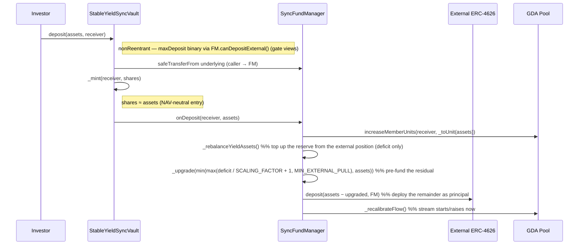

# Deposit Flow

How a deposit (or mint) moves through the system. Deposit is a single synchronous
transaction — there is no waiting room, epoch, snapshot, or settlement. See
[`../design.md`](../design.md) for the model and [`../invariants.md`](../invariants.md)
for the properties.

## Contracts involved

| Contract | Role |
|---|---|
| **StableYieldSyncVault** | ERC-4626 face. Pulls underlying from the caller, forwards it to the FundManager, mints shares. Holds no assets |
| **SyncFundManager** | Sole custodian. Owns the external-vault shares and the super-token reserve. Pre-funds the reserve, deploys the remainder into the external vault, starts the stream |
| **External ERC-4626** | Morpho Vault V2 that custodies the principal and earns the real, compounding yield (`max*` hardcoded 0 — never consulted; position valued via `previewRedeem`, eligibility via gate views) |
| **GDA Pool** | Superfluid pool owned by the FM. Streams the yield super-token to unit holders |

## Asset locations

| Location | What lives there |
|---|---|
| Investor wallet | The underlying being deposited |
| External vault (held by FM) | Deployed principal + the compounding external surplus. Valued via `EXTERNAL_VAULT.previewRedeem(balanceOf(FM))` |
| Reserve (FM, super-token) | The pre-fund slice that funds the GDA stream. Counted in NAV via `scaledYieldAssetsBalance()` |
| FM (raw underlying) | Transient only — 0 at rest (custody hazard, [A.1](../invariants.md#a1--no-raw-underlying-at-rest-in-the-fundmanager-echidna)) |

## Sequence

## Step by step

1. **Vault entry.** `deposit(assets, receiver)` (or `mint`). `nonReentrant`. OZ checks
   `assets <= maxDeposit(receiver)`, which is binary: `type(uint256).max` while the FM's
   deposit-side gates clear (`FUND_MANAGER.canDepositExternal()`), else 0.
   Shares are priced `previewDeposit(assets) = assets · (totalSupply + 10**offset) /
   (totalAssets + 1)`. Because the deposit raises external principal + reserve by exactly
   `assets`, NAV/supply is preserved and `shares ≈ assets` at entry.

2. **`_deposit`.** Transfer `assets` from the caller straight to the FM, `_mint` the
   shares (the `_update` hook skips `onShareTransfer` on the mint leg), then call
   `FUND_MANAGER.onDeposit(receiver, assets)`.

3. **`onDeposit(receiver, assets)`** (`VAULT_ROLE`):
   - **Grant units.** `units = _toUnit(assets) = assets / RAW_PER_UNIT` (one whole token
     → `1e6` units). A sub-`RAW_PER_UNIT` dust deposit maps to 0 units and is skipped.
     The reserve target now reflects the new, higher unit count.
   - **Top up the reserve.** `_rebalanceYieldAssets()` pulls
     `min(deficit / SCALING_FACTOR + 1, externalPositionValue())` from the external
     position and upgrades it — only the *deficit*, so the external surplus stays
     compounding, and only when the pull is at least `MIN_EXTERNAL_PULL` (10 atoms; the
     Base USDCx wrapper routes its reserves into Aave v3, which reverts dust supplies —
     a skipped sub-dust shortfall self-corrects). No external calls when already
     solvent. The cap is the position's *value* (Morpho V2 has no liquidity view), so
     the pull can revert on an external liquidity shortfall and brick the deposit until
     liquidity returns (accepted; `forceDeallocate` unsticks).
   - **Pre-fund the residual.** If a deficit remains, upgrade
     `min(max(deficit / SCALING_FACTOR + 1, MIN_EXTERNAL_PULL), assets)` of the
     incoming underlying into the reserve (the floor keeps the upgrade
     wrapper-acceptable and the GDA buffer fundable on dust bootstrap deposits;
     sub-`MIN_EXTERNAL_PULL` deposits onto an empty reserve are not viable).
   - **Deploy the remainder.** `EXTERNAL_VAULT.deposit(assets − upgraded, FM)`. Nothing is
     left at rest in the FM.
   - **Recalibrate.** `_recalibrateFlow()` starts/raises the stream this block, including
     for the first deposit. The hook cannot run under terminal impairment because the
     vault is paused (`maxDeposit == 0`) there.

## Why the stream starts now (and is NAV-neutral)

- A Superfluid stream cannot be partially started — `distributeFlow` needs the whole
  reserve to back the whole flow. The deficit-only rebalance pulls any pre-existing
  shortfall from the external position; the residual pre-fund covers whatever the external
  position could not. In every non-terminal state the post-deposit deficit is `≤ 0`, so the
  recalibrate brings the stream live.
- The deposit only changes the *form* of the FM's assets: `assets` of underlying becomes
  `(assets − upgraded)` external principal + `upgraded` reserve, **both counted in NAV**.
  So `totalAssets` rises by exactly `assets`, the share price is unchanged at entry, and
  the depositor is not diluted by funding their own stream — the pre-fund returns to them
  out-of-band as the stream while the external position replenishes the reserve. After
  entry the share floats with the external vault.

