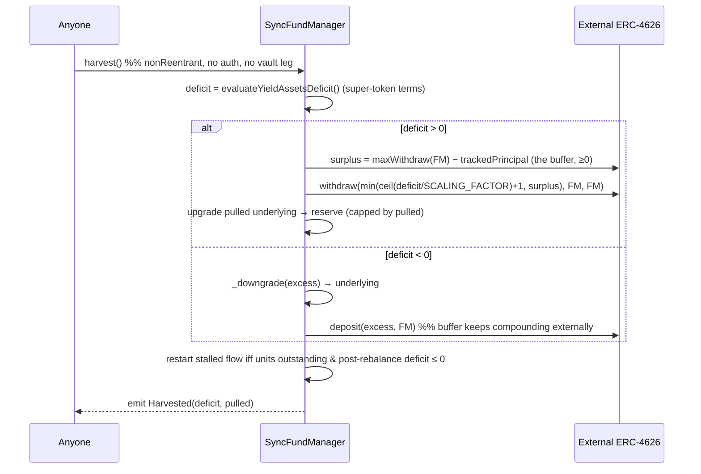

# Harvest Flow (Permissionless, FundManager entrypoint)

> **Revised 2026-05-19 (async-symmetric pivot).** `harvest()` is now a single
> permissionless **`SyncFundManager`** entrypoint with **no vault leg** — the
> direct analog of the async FM-entry `settleEpoch`. The FM holds the
> external-vault shares and `trackedPrincipal`, so it computes the surplus,
> withdraws from the external vault into itself, and tops the reserve without
> any callback. See `docs/sync-vault/design.md §Revision 2026-05-19`
> (decisions 6/11).

## Purpose

`harvest()` keeps the GDA yield stream solvent by replenishing the FM's
super-token reserve **from the external buffer only** — never from
`trackedPrincipal`. It tops the reserve up to its *deficit* (pulling at most the
buffer, `EXTERNAL_VAULT.maxWithdraw(FM) − trackedPrincipal`), trims any excess
back into the external vault, and restarts the stream if it stalled. Anything
beyond the deficit is deliberately left compounding inside the external vault as
the protocol-owned solvency buffer.

It is **permissionless**: the deficit and surplus are pure on-chain reads, so
there is nothing to manipulate by choosing the caller.

> The pre-fund at deposit time (see `deposit-flow.md`) is what *starts* the
> stream; `harvest()` is what *sustains* it by recycling the external surplus
> back into the reserve as the stream drains it.

> **`harvest()` is not the only solvency mechanism.** Its core
> deficit-clearing half — `_replenishReserveFromBuffer()` (the `deficit > 0`
> path: pull `min(need, buffer)` from the external vault, upgrade into the
> reserve) — also runs **best-effort at the start of every deposit and
> withdraw** (deficit-gated: no external calls when already solvent; capped at
> `EXTERNAL_VAULT.maxWithdraw(FM)` so it can never brick a user op). So the
> stream is kept forward-solvent on every interaction; the permissionless
> `harvest()` adds the **periodic-only excess trim** (`deficit < 0`) and the
> keeper-callable path for idle periods. The trim is never run in the per-op
> hooks (avoids per-deposit/withdraw churn).

## Contracts involved

| Contract | Role |
|---|---|
| **SyncFundManager** | Computes the deficit/surplus, withdraws the capped buffer out of the external vault into itself, upgrades it into the reserve, trims excess, restarts a stalled flow. Owns `trackedPrincipal` and the external-vault shares |
| **External ERC-4626** | Source of the harvestable surplus; services the partial withdrawal to the FM. Receives trimmed excess reserve back as buffer |
| **StableYieldVault** | Not involved. May expose a thin `harvest()` → `FUND_MANAGER.harvest()` forwarder for ERC-4626 ergonomics; the canonical entrypoint is on the FM |

## Sequence diagram



## Flow

```
(1) Anyone → FundManager: harvest()      (nonReentrant, no auth)
    - deficit = evaluateYieldAssetsDeficit()
        = (targetYieldFlow + targetFeeFlow) * guaranteedFlowDuration
          − yieldAssetsBalance()                         (super-token terms)

    - if deficit > 0:
        need     = uint256(deficit) / SCALING_FACTOR + 1
                   (underlying; +1 covers non-18-dec clipping, mirrors the
                    base rebalance)
        externalMax = EXTERNAL_VAULT.maxWithdraw(address(this))   — FM as holder
        surplus     = externalMax > trackedPrincipal
                        ? externalMax − trackedPrincipal : 0      — the buffer
        pulled      = min(need, surplus)
        if pulled > 0:
            EXTERNAL_VAULT.withdraw(pulled, address(this), address(this))
              — underlying lands in the FM; trackedPrincipal is NOT changed
                (only the buffer/surplus moves). Burns the FM's external-vault
                shares for `pulled`.
            toUpgrade = min(need, unutilizedAssetsBalance())
            if toUpgrade > 0: _upgrade(toUpgrade)        — best effort; never
              reverts on a shortfall (an under-funded stream stalls and
              recovers on a later harvest — Invariant 5 / accepted model).
              The just-pulled underlying is upgraded in the SAME call, so no
              principal/underlying is left at rest (custody hazard invariant).

    - else if deficit < 0:                               — excess reserve
        _downgrade(uint256(-deficit))                    — super-token → underlying
        EXTERNAL_VAULT.deposit(uint256(-deficit), address(this))
          — redeposit the excess into the external vault so the buffer keeps
            compounding externally (it is NOT left idle in the FM, unlike the
            original sync model which left it as FM underlying).

    - if POOL.getTotalFlowRate() == 0 && POOL.getTotalUnits() > 0
         && evaluateYieldAssetsDeficit() <= 0:
        _recalibrateFlow()                               — restart a stalled
          stream only when the (post-rebalance) reserve can fund the target,
          keeping harvest() non-reverting under persistent under-funding.

    - emit Harvested(deficit, pulled)
```

## Why only the deficit?

Pulling only `min(need, surplus)` — never the whole surplus — is what makes the
buffer **compound** and **absorb losses**:

- The surplus beyond `need` stays as external-vault shares, keeps earning the
  real external yield, and is the first capital consumed by an external loss
  (before any user-facing dip).
- `trackedPrincipal` is never read-from or written-to by harvest, so the share
  price does not jump on a harvest beyond the reserve top-up, which is already
  in NAV. (NAV does tick *up* by the reserve replenishment that offsets the
  stream's continuous drain — see `design.md §Security`, share-price ticking.)

## Operator backstop

When the external vault genuinely under-earns the promised rate, there is no
surplus to harvest and the stream stays stalled. Recovery is operator-driven
(same trust model as the async vault, design decision 8):

- `SyncFundManager.fundReserve(amount)` (`FUND_OPERATOR_ROLE`) injects
  underlying into the FM, then
- `ensureYieldFlowDuration()` (`FUND_OPERATOR_ROLE`, inherited from the base)
  rebalances it into the reserve and restarts the stream; **or**
- the operator lowers `setStableYieldRate(newRate)` to a sustainable level
  (which rebalances + recalibrates as part of the base setter).

## Key invariants

1. **Stream sustained only from harvested external surplus** (plus the optional
   operator injection). Harvest never reads or writes `trackedPrincipal`.
2. **Buffer is non-extracted.** Only the reserve *deficit* is ever pulled;
   `EXTERNAL_VAULT.maxWithdraw(FM) ≥ trackedPrincipal` is preserved while
   solvent; trimmed excess is redeposited into the external vault, not kept idle.
3. **Reserve horizon (best effort).** Harvest targets
   `yieldAssetsBalance() ≥ totalFlowRate · guaranteedFlowDuration`; nothing
   structurally enforces it (same trust model as the async vault — a
   permissionless/operator harvest must keep it fresh).
4. **Permissionless & manipulation-safe.** Deficit and surplus are pure
   on-chain state; the caller identity does not affect the outcome.
5. **No idle assets after harvest.** Pulled underlying is upgraded, and trimmed
   excess is redeposited, within the same call (custody hazard invariant —
   Inv. 7 in `design.md`).
