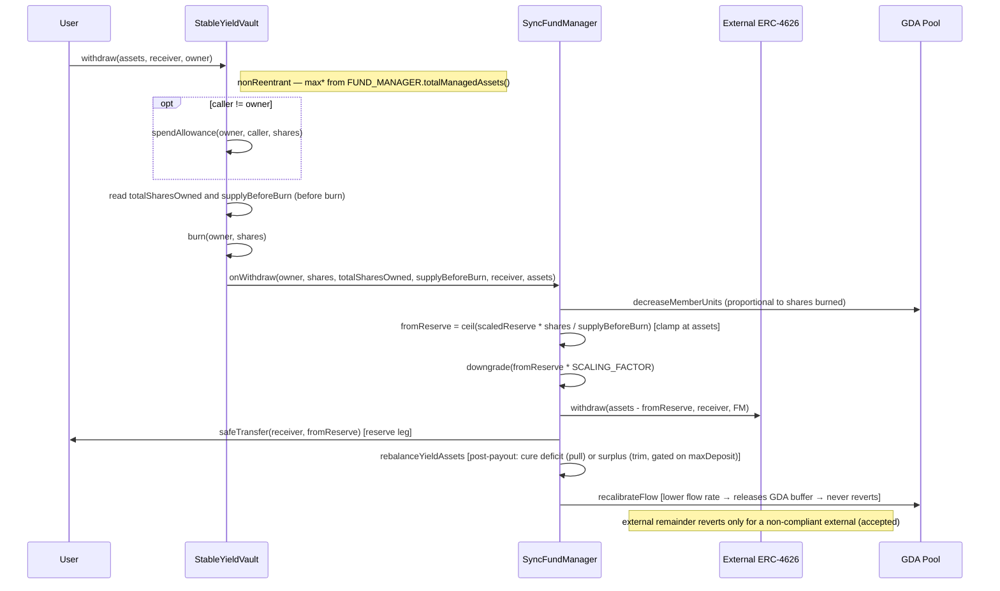

# Investor Withdraw / Redeem Flow (Synchronous)

> **Revised 2026-05-19 (async-symmetric pivot); revised 2026-05-26 (NAV clamp
> dropped — floating share); revised 2026-05-29 (R-shares reserve sourcing).**
> The FundManager is the sole custodian and does the payout. Redemption returns
> the **reserve-inclusive NAV pro-rata** (`shares · NAV / supply`, NAV the
> unclamped plain sum). The reserve slice is sourced **shares-proportionally**
> (`fromReserve = ceil(scaledReserve · shares / supplyBeforeBurn)`, clamped at the
> payout); the external vault funds the remainder. Combined with OZ's floor-priced
> `redeemingAssets`, this keeps `fromExternal ≤ EXTERNAL_VAULT.maxWithdraw(FM)`
> for a compliant external, so **F.2 holds end-to-end under any loss state**. There
> is **no pre-payout rebalance** (it was the eviction mechanism that broke the
> redeemer's reserve slice under loss — removed 2026-05-29); a single
> **post-payout** `_rebalanceYieldAssets()` cures any deficit/surplus the
> shares-proportional sourcing leaves (best-effort, D.1), and `_recalibrateFlow()`
> runs **at the end** (the lower flow rate releases GDA buffer, so it never reverts
> from a drained reserve). There is **no `trackedPrincipal` decrement** — OZ
> proportional accounting keeps stayers whole. See `docs/sync-vault/design.md`
> (decisions 5/11, Revisions 2026-05-26 / 2026-05-29).

## Contracts involved

| Contract | Role |
|---|---|
| **StableYieldVault** | ERC-4626 face. Spends allowance, burns shares, delegates the payout to the FM. Holds **no** assets |
| **SyncFundManager** | Sole custodian. Proportional unit decrease, funds the payout (shares-proportional reserve slice + external remainder), post-payout rebalance, then recalibrates the (lower) flow. No principal counter |
| **External ERC-4626** | Services the external remainder in underlying. Reverts only for a non-compliant external (accepted, decision 5) |
| **GDA Pool** | Superfluid pool; the holder's stream stops/shrinks proportionally |

## Asset states

| State | Location | Description |
|---|---|---|
| PRINCIPAL | External ERC-4626 (held by **FM**) | Recoverable via `EXTERNAL_VAULT.maxWithdraw(FM)`; the redeemer's pro-rata slice exits with them (no principal counter) |
| YIELD-ASSET RESERVE | FundManager (super-token) | A **shares-proportional** slice (`ceil(scaledReserve · shares / supplyBeforeBurn)`, clamped at `redeemingAssets`) is downgraded to fund the redeemer's reserve leg |
| EXTERNAL SURPLUS | External ERC-4626 (held by **FM**) | Compounding surplus, counted in NAV (accrues to holders); the post-payout rebalance replenishes any reserve deficit from it (best-effort) |
| ASSETS | Receiver wallet | Underlying delivered: reserve leg (from downgrade) + external remainder |

## Sequence diagram



## Flow

```
(1) User → Vault: withdraw(assets, receiver, owner)   [or redeem(shares, …)]
    - nonReentrant
    - OZ ERC-4626 checks:
        withdraw: assets <= maxWithdraw(owner)
                  = min(convertToAssets(balanceOf(owner)),
                        FUND_MANAGER.totalManagedAssets())
        redeem:   shares <= maxRedeem(owner)
                  = min(balanceOf(owner),
                        convertToShares(FUND_MANAGER.totalManagedAssets()))
      (both forced to 0 under terminal external impairment — see Impairment)
      totalManagedAssets() = EXTERNAL_VAULT.maxWithdraw(FM) + scaledReserve
                                                            + rawUnderlying
      — the reserve-inclusive plain sum (no clamp) is the global upper bound on
      what a redeem can source: the shares-proportional reserve slice scales with
      the redeemer's share fraction, and the external remainder is covered by the
      external position; under loss the lower recoverable NAV shrinks this. A
      larger request reverts up-front with
      ERC4626ExceededMaxWithdraw / ERC4626ExceededMaxRedeem.
    - withdraw: shares = previewWithdraw(assets) = _convertToShares(assets, Ceil)
      redeem:   assets = previewRedeem(shares)   = _convertToAssets(shares, Floor)
      `assets` is the redeemer's pro-rata slice of the RESERVE-INCLUSIVE NAV
      (= EXTERNAL_VAULT.maxWithdraw(FM) + scaledReserve + rawUnderlying), priced
      at the current (floating) share value.

(2) Vault._withdraw(caller, receiver, owner, assets, shares)   — CEI ordering:
    a. if caller != owner: _spendAllowance(owner, caller, shares)
    b. totalSharesOwned = balanceOf(owner)            (read BEFORE the burn)
       supplyBeforeBurn  = totalSupply()              (read BEFORE the burn)
    c. _burn(owner, shares)                            — `_update` skips the
       onShareTransfer hook for the burn leg (to == address(0))
    d. FUND_MANAGER.onWithdraw(owner, shares, totalSharesOwned,
                               supplyBeforeBurn, receiver, assets)        (3)
       (vault internal state is fully updated before the FM's external
        interaction; `nonReentrant` backstops the external calls)
    e. emit Withdraw(caller, receiver, owner, assets, shares)

(3) FundManager.onWithdraw(holder, shares, totalSharesOwned,
                           supplyBeforeBurn, receiver, redeemingAssets)
    (onlyRole VAULT_ROLE) — the async settleEpoch-netting analog:
    - reverts BAD_WITHDRAW_ARGS if totalSharesOwned == 0 or
      shares > totalSharesOwned
    - UNIT DECREASE (proportional to shares burned):
        holderUnits = POOL.getUnits(holder)
        if holderUnits > 0:
          delta = (shares == totalSharesOwned)
                ? holderUnits
                : holderUnits.mulDiv(shares, totalSharesOwned, Ceil)
          POOL.decreaseMemberUnits(holder, delta)
        (a dust position can hold shares but 0 units → nothing to decrement,
         skipped rather than reverted so the withdrawal is never bricked)
    - RESERVE LEG (shares-proportional — R-shares, Revision 2026-05-29):
        fromReserve = ceil(scaledYieldAssetsBalance() · shares / supplyBeforeBurn)
        if fromReserve > redeemingAssets: fromReserve = redeemingAssets   (clamp)
        if fromReserve > 0: _downgrade(fromReserve · SCALING_FACTOR)
        — sourcing the slice from the share fraction `f = shares / supplyBeforeBurn`
          (rather than the recalibration-freed excess) is what makes the external
          leg bounded: fromExternal = f · ext.maxWithdraw + f · raw, and raw = 0
          at rest (Inv. 7), so fromExternal ≤ ext.maxWithdraw(FM) — F.2 holds
          end-to-end under loss for a compliant external. Ceil is the safe
          rounding direction (paired with OZ's floor `redeemingAssets`).
    - EXTERNAL REMAINDER:
        fromExternal = redeemingAssets − fromReserve
        if fromExternal > 0:
          EXTERNAL_VAULT.withdraw(fromExternal, receiver, FM)
            — reverts only for a non-compliant external (accepted, dec. 5)
        if fromReserve > 0:
          UNDERLYING_ASSET.safeTransfer(receiver, fromReserve)
        → receiver has exactly redeemingAssets; the FM holds 0 underlying.
    - POST-PAYOUT REBALANCE (cure the deficit/surplus R-shares left):
        _rebalanceYieldAssets()
        — shares-proportional sourcing can leave the reduced unit count's reserve
          slightly under target (`f > f_u`: pull from external, capped at
          EXTERNAL_VAULT.maxWithdraw(FM)) or over target (`f < f_u`: trim back to
          external — best-effort, gated on EXTERNAL_VAULT.maxDeposit(FM) ≥
          underlyingNeeded, OQ #4). Best-effort (D.1); Inv. 7 / A.2 (no raw
          underlying at rest) holds hard throughout.
    - RECALIBRATE (at the end, unconditional):
        _recalibrateFlow()
        — the new (lower) flow rate reflects the reduced unit count. A flow-rate
          DECREASE releases GDA deposit buffer and never needs the reserve, so it
          cannot revert from a drained reserve. There is no in-hook guard;
          terminal impairment is kept out of this hook by the vault-level pause
          (it makes max* == 0), not by a guard.
    - NO PRINCIPAL-COUNTER STEP. `redeemingAssets = shares · NAV / supply`
      (OZ previewRedeem, floor), so the burn removed exactly the redeemer's
      pro-rata slice of NAV; the share price is unchanged for stayers (floor
      rounding favours them). The old proportional `trackedPrincipal` decrement
      is no longer needed.
```

## Why shares-proportional reserve sourcing (R-shares)

The earlier design tied the reserve draw to the recalibration-*freed* excess and
claimed the stayers' horizon held "by construction." That only held under the
dropped NAV clamp, where `units / share` was effectively uniform across holders.
Under the floating share + locked Invariant 6 (units track contributed principal,
not shares), `units / share` drift is the *normal* state, and either the stayers'
horizon (Decision 5) or the never-bricking `max*` contract (F.2) had to give. The
freed-excess sourcing also shipped a **pre-payout** rebalance that physically
evicted the redeemer's reserve slice back to the external vault *before* they
could consume it; under any loss state a redeem within `maxRedeem` then asked the
external for the full NAV slice, exceeded `ext.maxWithdraw(FM)`, and reverted —
an F.2 break against a compliant external.

R-shares picks F.2 (the user-visible API contract). The reserve slice is the
holder's share fraction of the reserve, so the external leg is bounded by the
external's own `maxWithdraw`:

```
f             = shares / supplyBeforeBurn              (the redeemer's NAV fraction)
redeemingAssets ≈ f · NAV                              (OZ floor)
fromReserve   ≈ f · scaledReserve                      (Ceil; safe rounding direction)
fromExternal  = redeemingAssets − fromReserve
              = f · ext.maxWithdraw + f · raw
              ≤ ext.maxWithdraw(FM)                    (raw = 0 at rest, Inv. 7)
```

The stayers' horizon is then restored **best-effort** by the single post-payout
rebalance (D.1), not by construction — the post-payout rebalance pulls back any
deficit (`f > f_u`) or trims any surplus (`f < f_u`) the shares-proportional
sourcing leaves for the reduced unit count.

## Impairment (loss pass-through)

"Partial impairment" terminology is dropped. Two regimes:

- **Loss** (`EXTERNAL_VAULT.maxWithdraw(FM) > 0` but the external position has
  lost some principal). NAV (`totalManagedAssets()`, the unclamped sum) falls, so
  `previewRedeem` prices the share **below the entry price** and the exiting
  holder takes the pro-rata impaired payout — honest, immediate pass-through.
  There is no accumulated buffer to delay it (the external surplus that would have
  cushioned it was already booked into the share price as appreciation while
  external was out-earning the rate). The burn removes exactly
  `redeemingAssets = shares · NAV / supply` (floor), so the share price is
  unchanged for remaining holders — **no value transfers between leavers and
  stayers**, guaranteed by OZ proportional accounting rather than a
  principal-counter decrement. The **reserve leg is unaffected by external
  impairment** (it is downgraded super-token, not external-vault shares); only the
  external remainder carries the external loss. F.2 holds end-to-end here (R-shares
  keeps `fromExternal ≤ ext.maxWithdraw(FM)`).
- **Terminal impairment** (`EXTERNAL_VAULT.maxWithdraw(FM) == 0` while the FM
  holds a position). The vault is **fully paused** (`_isExternallyPaused()` forces
  all four `max*` to 0), so a request can't land here; the Superfluid stream keeps
  paying existing holders from the reserve until it is naturally liquidated. See
  `design.md §Revision 2026-05-27` and invariants.md D.2.

## ERC-4626 compliance

- `withdraw` / `redeem` are synchronous; `previewWithdraw` / `previewRedeem`
  do not revert (OZ defaults).
- `maxWithdraw` / `maxRedeem` reflect serviceability via
  `totalManagedAssets()` (the reserve-inclusive unclamped NAV — 4626-honest
  under loss via the lower recoverable NAV; never bricks a request ≤ max* for a
  compliant external). Forced to 0 under terminal external impairment.
- Allowance is spent on the owner when `caller != owner` (standard ERC-4626).

## Key invariants

1. **Share accounting (OZ-standard, no principal counter).** The redeemer is
   paid `redeemingAssets = shares · NAV / supply` (floor); there is no
   `trackedPrincipal` decrement.
2. **No inter-holder value transfer on exit.** Because the payout is exactly the
   burned shares' pro-rata of NAV, the share price (`NAV / supply`) is unchanged
   for stayers — floor rounding favours them. (This is the property the old
   proportional `trackedPrincipal` decrement enforced manually; OZ accounting
   now gives it for free.)
3. **F.2 holds end-to-end under loss (compliant external).** The
   shares-proportional reserve slice (`fromReserve = ceil(scaledReserve · shares
   / supplyBeforeBurn)`, clamped at `redeemingAssets`) keeps `fromExternal ≤
   EXTERNAL_VAULT.maxWithdraw(FM)`, so any request ≤ `max*` is serviceable for a
   compliant external in any loss state. The external remainder reverts only for
   a non-compliant external (decision 5, accepted; pinned by
   `test_withdraw_brickedByNonCompliantExternal`).
4. **Stayers' horizon — best-effort (D.1), not by construction.** The single
   post-payout `_rebalanceYieldAssets()` restores the reduced unit count's reserve
   target (pull on deficit, trim on surplus); under external supply constraints it
   can sit above/below target without bricking the exit.
5. **Reserve-inclusive payout.** The redeemer receives their pro-rata of the
   reserve-inclusive NAV: shares-proportional reserve leg + external remainder.
   The external-illiquidity revert applies to the remainder only.
6. **No vault custody.** The vault never holds or fronts assets; the FM moves
   everything and holds 0 underlying at rest (custody hazard invariant — Inv. 7
   in `design.md`, A.2 in `invariants.md`).
