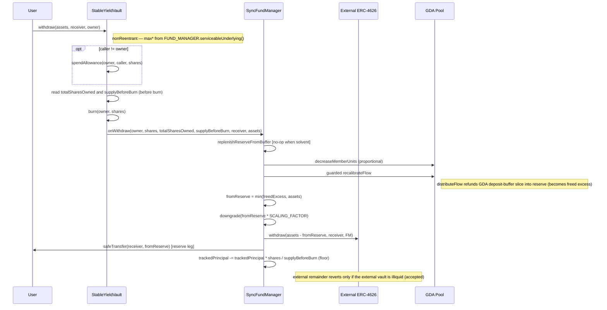

# Investor Withdraw / Redeem Flow (Synchronous)

> **Revised 2026-05-19 (async-symmetric pivot; netting locked 2026-05-19).** The
> FundManager is the sole custodian and does the payout. Redemption returns the
> **reserve-inclusive NAV pro-rata**. The reserve slice is NOT an NAV-pro-rata
> downgrade — it is the **recalibration-freed reserve excess**: decreasing the
> redeemer's units lowers the required reserve, and only that freed excess
> (capped at the payout) is downgraded, so remaining holders' stream horizon is
> preserved by construction. The external vault funds the remainder. See
> `docs/sync-vault/design.md` (decisions 5/11, Revision rows C/D).

## Contracts involved

| Contract | Role |
|---|---|
| **StableYieldVault** | ERC-4626 face. Spends allowance, burns shares, delegates the payout + accounting to the FM. Holds **no** assets |
| **SyncFundManager** | Sole custodian. Best-effort buffer replenish, proportional unit decrease, proportional `trackedPrincipal` decrement, funds the payout (freed-reserve-excess leg + external remainder), recalibrates the (lower) flow |
| **External ERC-4626** | Services the external remainder in underlying. Reverts only if illiquid (accepted, decision 5) |
| **GDA Pool** | Superfluid pool; the holder's stream stops/shrinks proportionally |

## Asset states

| State | Location | Description |
|---|---|---|
| PRINCIPAL | External ERC-4626 (held by **FM**) | `trackedPrincipal`; decremented proportionally to shares burned |
| YIELD-ASSET RESERVE | FundManager (super-token) | The recalibration-*freed* excess (after the unit decrease) is downgraded to fund the redeemer's reserve slice |
| BUFFER | External ERC-4626 (held by **FM**) | Compounding surplus; replenishes the reserve (best-effort, start of the call); absorbs external losses before any user-facing dip |
| ASSETS | Receiver wallet | Underlying delivered: freed-reserve-excess leg (from downgrade) + external remainder |

## Sequence diagram



## Flow

```
(1) User → Vault: withdraw(assets, receiver, owner)   [or redeem(shares, …)]
    - nonReentrant
    - OZ ERC-4626 checks:
        withdraw: assets <= maxWithdraw(owner)
                  = min(convertToAssets(balanceOf(owner)),
                        FUND_MANAGER.serviceableUnderlying())
        redeem:   shares <= maxRedeem(owner)
                  = min(balanceOf(owner),
                        convertToShares(FUND_MANAGER.serviceableUnderlying()))
      serviceableUnderlying() = totalManagedAssets()
                              = min(trackedPrincipal, ext.maxWithdraw(FM)
                                                      + scaledReserve)
                                + unutilizedAssetsBalance()
      — the reserve-inclusive NAV is the global upper bound on what a redeem
      can source: the recalibration-freed reserve excess scales with the
      redeemer's unit share, and the external remainder is covered by the
      external position; under impairment the NAV clamp shrinks this
      appropriately. A larger request reverts up-front with
      ERC4626ExceededMaxWithdraw / ERC4626ExceededMaxRedeem.
    - withdraw: shares = previewWithdraw(assets) = _convertToShares(assets, Ceil)
      redeem:   assets = previewRedeem(shares)   = _convertToAssets(shares, Floor)
      `assets` is the redeemer's pro-rata slice of the RESERVE-INCLUSIVE NAV
      (= min(trackedPrincipal, ext.maxWithdraw(FM)) + unutilized + scaledReserve).

(2) Vault._withdraw(caller, receiver, owner, assets, shares)   — CEI ordering:
    a. if caller != owner: _spendAllowance(owner, caller, shares)
    b. totalSharesOwned = balanceOf(owner)            (read BEFORE the burn)
       supplyBeforeBurn  = totalSupply()              (read BEFORE the burn)
    c. _burn(owner, shares)                            — `_update` skips the
       onShareTransfer hook for the burn leg (to == address(0))
    d. FUND_MANAGER.onWithdraw(owner, shares, totalSharesOwned,
                               supplyBeforeBurn, receiver, assets)        (3)
       (vault internal state is fully updated before the FM's external
        interaction; `nonReentrant` backstops the external calls)
    e. emit Withdraw(caller, receiver, owner, assets, shares)

(3) FundManager.onWithdraw(holder, shares, totalSharesOwned,
                           supplyBeforeBurn, receiver, redeemingAssets)
    (onlyRole VAULT_ROLE) — the async settleEpoch-netting analog:
    - reverts BAD_WITHDRAW_ARGS if totalSharesOwned == 0 or
      shares > totalSharesOwned
    - PRE-REBALANCE (best-effort, deficit-gated):
        _rebalanceYieldAssets()
        — no external calls when evaluateYieldAssetsDeficit() == 0 (the common
          pre-withdraw case). Opportunistically cures a *pre-existing* deficit
          (external underperformed since the last rebalance) from the buffer
          (then principal-backing slice under impairment); capped at
          EXTERNAL_VAULT.maxWithdraw(FM) so it can never brick the exit.
    - UNIT DECREASE:
        holderUnits = POOL.getUnits(holder)
        if holderUnits > 0:
          delta = (shares == totalSharesOwned)
                ? holderUnits
                : holderUnits.mulDiv(shares, totalSharesOwned, Ceil)
          POOL.decreaseMemberUnits(holder, delta)
        (a dust position can hold shares but 0 units → nothing to decrement,
         skipped rather than reverted so the withdrawal is never bricked)
    - guarded _recalibrateFlow() **BEFORE the freed-excess step**
        if POOL.getTotalFlowRate() != 0 || evaluateYieldAssetsDeficit() <= 0
        — `distributeFlow(newFlowRate)` REFUNDS the GDA "deposit buffer" slice
          attributable to the removed units back into yieldAssetsBalance(), so
          it becomes part of the redeemer's freed excess. A stalled +
          still-under-funded vault is left stalled (the next operator-called
          `ensureYieldFlowDuration()` restarts it); the withdrawal still
          completes.
    - RESERVE LEG (the recalibration-freed excess):
        d = evaluateYieldAssetsDeficit()   (post-recalibrate)
        excessUnderlying = d < 0 ? uint256(-d) / SCALING_FACTOR : 0
        fromReserve = min(excessUnderlying, redeemingAssets)
        if fromReserve > 0: _downgrade(fromReserve · SCALING_FACTOR)
        — `fromReserve ≤ freedExcess`, so the post-withdraw reserve still
          satisfies the reduced unit count's horizon: STAYERS' STREAM IS
          PRESERVED BY CONSTRUCTION (no stall in the healthy case).
    - EXTERNAL REMAINDER:
        fromExternal = redeemingAssets − fromReserve
        if fromExternal > 0:
          EXTERNAL_VAULT.withdraw(fromExternal, receiver, FM)
            — reverts only if the external vault is illiquid (accepted, dec. 5)
        if fromReserve > 0:
          UNDERLYING_ASSET.safeTransfer(receiver, fromReserve)
        → receiver has exactly redeemingAssets; the FM holds 0 underlying.
    - POST-PAYOUT REBALANCE (trim residual freed excess back to external):
        _rebalanceYieldAssets()
        — if freedExcess > redeemingAssets, the residual freed excess remains
          as `deficit < 0` after the payout. The rebalance trim branch
          downgrades it and redeposits the underlying into the external vault,
          so the reserve returns to target. Inv. 7 holds (no raw underlying at
          rest in the FM).
    - PRINCIPAL ACCOUNTING (Inv. 1, rounded DOWN — favours remaining holders):
        trackedPrincipal -= trackedPrincipal.mulDiv(shares, supplyBeforeBurn,
                                                    Floor)
```

## Why the freed-excess leg (not an NAV-pro-rata downgrade)

Tying the reserve draw to the recalibration-*freed* excess (rather than to a
computed reserve fraction of NAV) is what makes the stayers' horizon hold **by
construction**: after the unit decrease the required reserve is
`totalFlowRate(U−Δ) · guaranteedFlowDuration`; only the amount the reserve now
exceeds *that* is downgraded for the redeemer, so the post-withdraw reserve is
still ≥ the (now lower) requirement. The freed excess ≈ the redeemer's pro-rata
reserve slice when the reserve sat at target; if it was over-funded, the extra
sourcing from reserve vs. external is value-neutral for stayers (total payout is
`redeemingAssets` either way) while still respecting the horizon.

## Impairment (loss pass-through)

When the external position is impaired
(`EXTERNAL_VAULT.maxWithdraw(FM) < trackedPrincipal`):

- The NAV floor `min(trackedPrincipal, EXTERNAL_VAULT.maxWithdraw(FM))` falls,
  so `previewRedeem` prices the share **below par** and the exiting holder takes
  the pro-rata impaired payout — honest pass-through.
- The proportional `trackedPrincipal` decrement
  (`P −= P · shares / supplyBeforeBurn`, floor) keeps `V/P` constant across the
  exit, so **no value transfers between leavers and remaining holders**. The
  floor rounding favours the vault / remaining holders.
- A small loss is absorbed first by the **buffer**: while
  `EXTERNAL_VAULT.maxWithdraw(FM) ≥ trackedPrincipal`, the NAV floor stays
  pinned at `trackedPrincipal` and the external remainder is whole — losses only
  reach users once they exceed the entire accumulated buffer.
- The **reserve leg is unaffected by external impairment** (it is freed/downgraded
  super-token, not external-vault shares); only the external remainder carries
  the external loss. This matches async, where the FM downgrades reserve to
  cover redeeming assets at settlement.

## ERC-4626 compliance

- `withdraw` / `redeem` are synchronous; `previewWithdraw` / `previewRedeem`
  do not revert (OZ defaults).
- `maxWithdraw` / `maxRedeem` reflect serviceability via
  `serviceableUnderlying()` (returns the reserve-inclusive NAV — 4626-honest
  under external impairment via the NAV clamp; never bricks a request ≤ max*).
- Allowance is spent on the owner when `caller != owner` (standard ERC-4626).

## Key invariants

1. **Principal accounting (FM-owned).** `trackedPrincipal −= trackedPrincipal ·
   sharesBurned / totalSupplyBeforeBurn` (floor; favours remaining holders).
2. **V/P invariant across impaired exits.** The proportional decrement keeps
   `EXTERNAL_VAULT.maxWithdraw(FM) / trackedPrincipal` constant through an
   exit — no inter-holder value transfer.
3. **Stayers' horizon preserved by construction.** Only the recalibration-freed
   reserve excess is downgraded (`fromReserve ≤ freedExcess`), so whenever
   `evaluateYieldAssetsDeficit() ≤ 0` held before the withdraw it still holds
   after for the reduced unit count.
4. **Reserve-inclusive payout.** The redeemer receives their pro-rata of the
   reserve-inclusive NAV: freed-reserve-excess leg + external remainder. The
   external-illiquidity revert applies to the remainder only.
5. **No vault custody.** The vault never holds or fronts assets; the FM moves
   everything and holds 0 underlying at rest (custody hazard invariant — Inv. 7
   in `design.md`).
